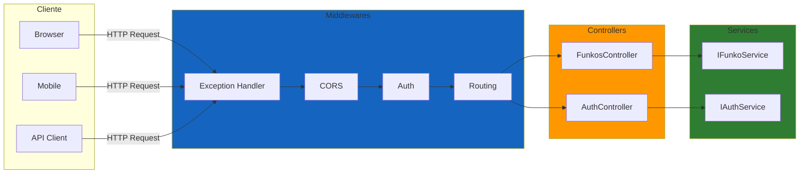
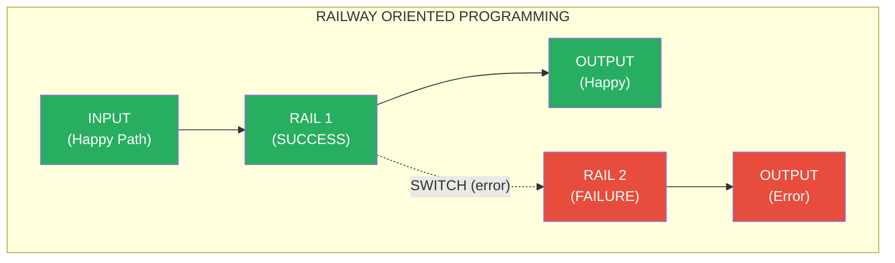
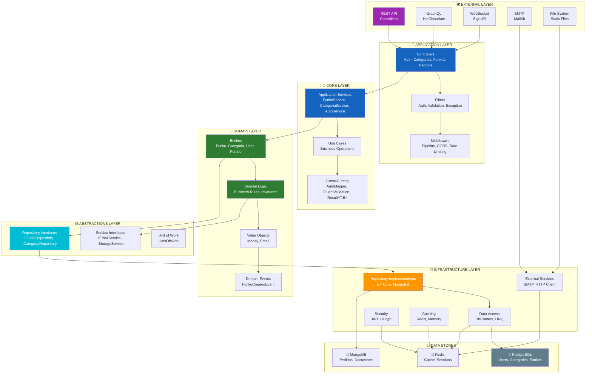
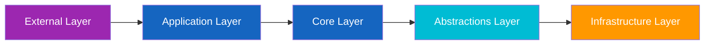
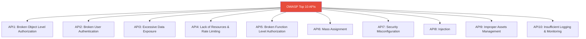
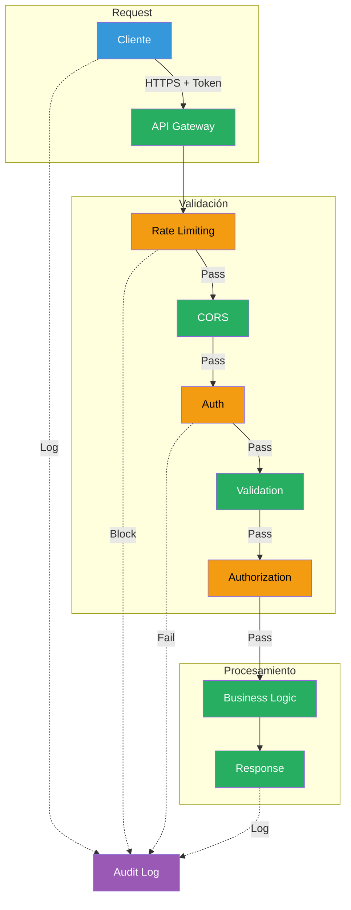
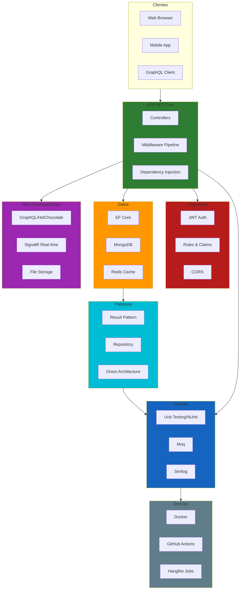

# 29. Resumen General del Modulo ASP.NET Core

## Indice

- [29.1. Conceptos Fundamentales](#291-conceptos-fundamentales)
  - [29.1.1. Fundamentos HTTP](#2911-fundamentos-http)
  - [29.1.2. Servicios Web RESTful](#2912-servicios-web-restful)
  - [29.1.3. ASP.NET Core](#2913-aspnet-core)
  - [29.1.4. Inyeccion de Dependencias](#2914-inyeccion-de-dependencias)
- [29.2. Patrones de Diseno y Arquitectura](#292-patrones-de-diseno-y-arquitectura)
  - [29.2.1. Patron Result (ROP)](#2921-patron-result-rop)
  - [29.2.2. Repository Pattern](#2922-repository-pattern)
  - [29.2.3. Arquitectura Onion y Clean Architecture](#2923-arquitectura-onion-y-clean-architecture)
  - [29.2.4. Mapeadores y DTOs](#2924-mapeadores-y-dtos)
  - [29.2.5. Validacion en Cascada](#2925-validacion-en-cascada)
- [29.3. Acceso a Datos](#293-acceso-a-datos)
  - [29.3.1. Entity Framework Core](#2931-entity-framework-core)
  - [29.3.2. MongoDB](#2932-mongodb)
  - [29.3.3. Redis Caching](#2933-redis-caching)
  - [29.3.4. Transacciones](#2934-transacciones)
- [29.4. Seguridad](#294-seguridad)
  - [29.4.1. JWT Authentication](#2941-jwt-authentication)
  - [29.4.2. Autorizacion Roles y Claims](#2942-autorizacion-roles-y-claims)
  - [29.4.3. Logging](#2943-logging)
  - [29.4.4. Seguridad en APIs REST](#2944-seguridad-en-apis-rest)
- [29.5. APIs Especializadas](#295-apis-especializadas)
  - [29.5.1. GraphQL con HotChocolate](#2951-graphql-con-hotchocolate)
  - [29.5.2. File Storage](#2952-file-storage)
  - [29.5.3. WebSockets y SignalR](#2953-websockets-y-signalr)
  - [29.5.4. Email Services](#2954-email-services)
- [29.6. Testing y DevOps](#296-testing-y-devops)
  - [29.6.1. Unit Testing con NUnit y Moq](#2961-unit-testing-con-nunit-y-moq)
  - [29.6.2. Docker y Containers](#2962-docker-y-containers)
  - [29.6.3. Optimizacion](#2963-optimizacion)
- [29.7. Configuracion y Organizacion](#297-configuración-y-organización)
  - [29.7.1. Documentacion con Swagger/OpenAPI](#2971-documentacion-con-swaggeropenapi)
  - [29.7.2. Perfiles y Configuracion](#2972-perfiles-y-configuración)
  - [29.7.3. Tareas Programadas](#2973-tareas-programadas)
  - [29.7.4. Organizacion de Program.cs](#2974-organización-de-programcs)
- [29.8. Mapa Mental del Ecosistema](#298-mapa-mental-del-ecosistema)
- [29.9. Checklist de Conocimientos](#299-checklist-de-conocimientos)
  - [29.9.1. Fundamentos y Patrones](#2991-fundamentos-y-patrones)
  - [29.9.2. Acceso a Datos](#2992-acceso-a-datos)
  - [29.9.3. Seguridad](#2993-seguridad)
  - [29.9.4. APIs Especializadas](#2994-apis-especializadas)
  - [29.9.5. Testing y DevOps](#2995-testing-y-devops)
- [29.10. Recursos y Proximos Pasos](#2910-recursos-y-proximos-pasos)

---

## 29.1. Conceptos Fundamentales

### 29.1.1. Fundamentos HTTP

HTTP es el protocolo fundamental de la web. Comprender sus metodos, codigos de estado y cabeceras es esencial para disenar APIs robustas.

**Metodos HTTP:**

| Metodo | Descripcion | Idempotente | Seguro |
| :----- | :----------------------- | :---------- | :----- |
| **GET** | Obtener recursos | ✅ Si | ✅ Si |
| **POST** | Crear recursos | ❌ No | ❌ No |
| **PUT** | Reemplazar completamente | ✅ Si | ❌ No |
| **PATCH** | Modificar parcialmente | ❌ No | ❌ No |
| **DELETE** | Eliminar recursos | ✅ Si | ❌ No |

**Codigos de Estado:**

| Codigo | Rango | Significado | Ejemplo |
| :------ | :------------- | :---------------------- | :----------------------------------------------------- |
| **200** | Exito | Operacion exitosa | `200 OK`, `201 Created`, `204 No Content` |
| **300** | Redireccion | Mas acciones necesarias | `304 Not Modified` |
| **400** | Error cliente | Error en la solicitud | `400 Bad Request`, `404 Not Found` |
| **500** | Error servidor | Error en el servidor | `500 Internal Server Error`, `503 Service Unavailable` |

### 29.1.2. Servicios Web RESTful

REST (Representational State Transfer) es un estilo arquitectonico para disenar servicios web escalables.

**Principios REST:**

| Principio | Descripcion | Ejemplo Practico |
| :----------------------- | :------------------------------- | :------------------------------------------ |
| **Recursos** | Todo es un recurso identificable | `/api/funkos`, `/api/categorias/1` |
| **URIs significativas** | Nombres sustantivos, no verbos | ✅ `/funkos`, ❌ `/getFunkos` |
| **HTTP methods** | Usar metodos HTTP correctamente | GET para leer, POST para crear |
| **Stateless** | Sin estado en el servidor | Token en cada peticion |
| **Representaciones** | Multiples formatos | JSON, XML, etc. |

### 29.1.3. ASP.NET Core

ASP.NET Core es el framework de Microsoft para construir aplicaciones web modernas, cross-platform y cloud-ready.

**Arquitectura del Pipeline:**



### 29.1.4. Inyeccion de Dependencias

```csharp
// Transient: Nuevo cada vez (ligero, stateless)
builder.Services.AddTransient<ILoggerService, LoggerService>();

// Scoped: Nuevo por request (DbContext, Repositories)
builder.Services.AddScoped<IFunkoRepository, FunkoRepository>();

// Singleton: Uno solo (configuraciones, cache)
builder.Services.AddSingleton<IConnectionMultiplexer>(ConnectionMultiplexer.Connect(connectionString));
```

---

## 29.2. Patrones de Diseno y Arquitectura

### 29.2.1. Patron Result (ROP)

El Patron Result (Railway Oriented Programming) permite manejar errores sin excepciones usando `CSharpFunctionalExtensions`.

**Conceptos Fundamentales:**

| Concepto | Descripcion | Ejemplo |
| ----------- | --------------------------------------------------- | ------------------------------------ |
| **Result** | Wrapper que encapsula exito o fallo | `Result<T, TError>` |
| **Success** | Camino happy path con valor | `Result.Success(value)` |
| **Failure** | Camino de error con mensaje | `Result.Failure(error)` |
| **Bind** | Encadena operaciones que retornan Result | `result.Bind()` |
| **Map** | Transforma el valor en exito | `result.Map(value => newValue)` |
| **Match** | Maneja ambos casos | `result.Match(onSuccess, onFailure)` |

**Diagrama del Patron ROP:**



**Implementacion:**

```csharp
public class FunkoService : IFunkoService
{
    private readonly IFunkoRepository _repository;
    private readonly IMapper _mapper;
    
    public async Task<Result<FunkoDto, DomainError>> GetByIdAsync(int id)
    {
        var funko = await _repository.GetByIdAsync(id);
        if (funko == null)
            return Result.Failure<FunkoDto, DomainError>(DomainErrors.NotFound);
        
        return Result.Success(_mapper.Map<FunkoDto>(funko));
    }
    
    public async Task<Result<FunkoDto, DomainError>> CreateAsync(CreateFunkoDto dto)
    {
        return await Validate(dto)
            .Bind(ValidateStockAsync)
            .Bind(CreateFunkoAsync)
            .Map(funko => _mapper.Map<FunkoDto>(funko));
    }
}

// Errores personalizados
public static class DomainErrors
{
    public static readonly DomainError NotFound = 
        new("ENTITY_NOT_FOUND", "Entidad no encontrada");
    public static readonly DomainError InvalidState = 
        new("INVALID_STATE", "Estado invalido para la operación");
}
```

### 29.2.2. Repository Pattern

```csharp
public interface IFunkoRepository
{
    Task<Result<Funko, DomainError>> GetByIdAsync(int id);
    Task<Result<Funko, DomainError>> AddAsync(Funko funko);
    Task<Result<Funko, DomainError>> UpdateAsync(Funko funko);
    Task<UnitResult<DomainError>> DeleteAsync(int id);
    Task<List<Funko>> GetAllAsync();
    Task<List<Funko>> GetByCategoriaAsync(int categoriaId);
}

public class FunkoRepository : IFunkoRepository
{
    private readonly AppDbContext _context;
    
    public async Task<Result<Funko, DomainError>> GetByIdAsync(int id)
    {
        var funko = await _context.Funkos
            .Include(f => f.Categoria)
            .FirstOrDefaultAsync(f => f.Id == id && !f.IsDeleted);
            
        if (funko == null)
            return Result.Failure<Funko, DomainError>(DomainErrors.NotFound);
            
        return Result.Success(funko);
    }
    // ... Implementacion de otros metodos
}
```

### 29.2.3. Arquitectura Onion y Clean Architecture

La arquitectura Onion (o arquitectura de capas) es un patron que situa el **dominio en el centro**, con las demas capas dependendiendo hacia adentro.

**Principios Fundamentales:**

| Principio | Implementacion |
| ----------------------------------- | --------------------------------------------------------------------- |
| **Core en el centro** | Modelos (Funko, Categoria, User) sin dependencias externas |
| **Inversion de dependencias** | Interfaces en core, implementaciones en infraestructura |
| **Separacion de responsabilidades** | Controllers → Services → Repositories → Data |
| **Cross-cutting concerns** | AutoMapper, FluentValidation, Result Pattern como utilidades |
| **Multi-Database** | PostgreSQL (datos maestros), MongoDB (documentos), Redis (cache) |

**Diagrama de Arquitectura Onion:**



**Flujo de Dependencias:**



**Estructura del Proyecto:**

```
src/
├── API/                              # Capa de presentacion (Controllers, Middleware)
│   ├── Controllers/
│   │   ├── FunkosController.cs
│   │   ├── AuthController.cs
│   │   └── PedidosController.cs
│   ├── Middleware/
│   │   └── ExceptionHandler.cs
│   └── Program.cs
│
├── Application/                      # Capa de aplicacion (Servicios, DTOs)
│   ├── Services/
│   │   ├── IFunkoService.cs
│   │   └── FunkoService.cs
│   ├── DTOs/
│   │   ├── FunkoDto.cs
│   │   └── CreateFunkoRequest.cs
│   └── Validators/
│       └── CreateFunkoValidator.cs
│
├── Domain/                           # Capa de dominio (Entidades, Interfaces)
│   ├── Entities/
│   │   ├── Funko.cs
│   │   └── Categoria.cs
│   ├── Interfaces/
│   │   ├── IFunkoRepository.cs
│   │   └── IUnitOfWork.cs
│   ├── Errors/
│   │   └── DomainErrors.cs
│   └── Enums/
│       └── UserRole.cs
│
└── Infrastructure/                   # Capa de infraestructura (DB, externos)
    ├── Data/
    │   ├── AppDbContext.cs
    │   └── Repositories/
    │       └── FunkoRepository.cs
    ├── Cache/
    │   └── RedisCacheService.cs
    ├── Auth/
    │   └── JwtService.cs
    └── Services/
        └── EmailService.cs
```

**Ventajas de la Arquitectura:**

| Ventaja | Descripcion |
| ------------------ | ------------------------------------------ |
| **Testabilidad** | Core sin dependencias → facil mocking |
| **Mantenibilidad** | Cambios en infraestructura no afectan core |
| **Flexibilidad** | Multi-database strategy implementado |
| **Escalabilidad** | Separacion clara de responsabilidades |
| **Seguridad** | JWT, BCrypt, Claims bien encapsulados |

### 29.2.4. Mapeadores y DTOs

**AutoMapper:**

```csharp
// Profile de mapeo
public class MappingProfile : Profile
{
    public MappingProfile()
    {
        CreateMap<Funko, FunkoResponseDto>()
            .ForMember(dest => dest.CategoriaNombre, 
                opt => opt.MapFrom(src => src.Categoria.Nombre));
        
        CreateMap<CreateFunkoDto, Funko>()
            .ForMember(dest => dest.CategoriaId, 
                opt => opt.MapFrom(src => src.CategoriaId));
    }
}
```

### 29.2.5. Validacion en Cascada

**FluentValidation:**

```csharp
public class CreateFunkoDtoValidator : AbstractValidator<CreateFunkoDto>
{
    public CreateFunkoDtoValidator()
    {
        RuleFor(x => x.Nombre)
            .NotEmpty().WithMessage("El nombre es obligatorio")
            .Length(3, 100).WithMessage("El nombre debe tener entre 3 y 100 caracteres");
        
        RuleFor(x => x.Precio)
            .GreaterThan(0).WithMessage("El precio debe ser mayor a 0");
        
        RuleFor(x => x.CategoriaId)
            .GreaterThan(0).WithMessage("La categoria debe ser valida");
    }
}
```

---

## 29.3. Acceso a Datos

### 29.3.1. Entity Framework Core

```csharp
public class AppDbContext : DbContext
{
    public DbSet<Funko> Funkos => Set<Funko>();
    public DbSet<Categoria> Categorias => Set<Categoria>();

    protected override void OnModelCreating(ModelBuilder modelBuilder)
    {
        modelBuilder.Entity<Funko>(entity =>
        {
            entity.HasKey(e => e.Id);
            entity.Property(e => e.Nombre).IsRequired().HasMaxLength(100);
            entity.HasQueryFilter(f => !f.IsDeleted);
        });
    }
}
```

### 29.3.2. MongoDB

```csharp
// Aggregation Pipeline
public async Task<Dictionary<string, int>> GetStockPorCategoriaAsync()
{
    var pipeline = new BsonDocument[]
    {
        new BsonDocument("$match", new BsonDocument("IsDeleted", false)),
        new BsonDocument("$group", new BsonDocument
        {
            { "_id", "$Categoria" },
            { "Total", new BsonDocument("$sum", "$Stock") }
        })
    };
    // ...
}
```

### 29.3.3. Redis Caching

```csharp
// Cache-Aside Pattern
public async Task<FunkoDto?> GetByIdAsync(int id)
{
    var cacheKey = $"funko:{id}";
    var cached = await _cache.GetAsync<FunkoDto>(cacheKey);
    
    if (cached != null)
        return cached;
    
    var funko = await _repository.GetByIdAsync(id);
    if (funko != null)
        await _cache.SetAsync(cacheKey, funko, TimeSpan.FromMinutes(10));
    
    return funko;
}
```

### 29.3.4. Transacciones

```csharp
public async Task<Result<Pedido>> CreatePedidoAsync(CreatePedidoDto dto)
{
    using var transaction = await _context.Database.BeginTransactionAsync();
    
    try
    {
        var pedido = new Pedido(dto.UsuarioId);
        _context.Pedidos.Add(pedido);
        
        foreach (var item in dto.Items)
        {
            var funko = await _context.Funkos.FindAsync(item.FunkoId);
            if (funko == null || funko.Stock < item.Cantidad)
            {
                await transaction.RollbackAsync();
                return Result.Failure<Pedido>("Stock insuficiente");
            }
            funko.Stock -= item.Cantidad;
        }
        
        await _context.SaveChangesAsync();
        await transaction.CommitAsync();
        
        return Result.Success(pedido);
    }
    catch (Exception ex)
    {
        await transaction.RollbackAsync();
        return Result.Failure<Pedido>(ex.Message);
    }
}
```

---

## 29.4. Seguridad

### 29.4.1. JWT Authentication

```csharp
builder.Services.AddAuthentication(JwtBearerDefaults.AuthenticationScheme)
    .AddJwtBearer(options =>
    {
        options.TokenValidationParameters = new TokenValidationParameters
        {
            ValidateIssuer = true,
            ValidateAudience = true,
            ValidateLifetime = true,
            ValidateIssuerSigningKey = true,
            ValidIssuer = builder.Configuration["Jwt:Issuer"],
            ValidAudience = builder.Configuration["Jwt:Audience"],
            IssuerSigningKey = new SymmetricSecurityKey(
                Encoding.UTF8.GetBytes(builder.Configuration["Jwt:Key"]))
        };
    });
```

### 29.4.2. Autorizacion Roles y Claims

```csharp
// Roles simples
[Authorize(Roles = "Admin")]
public class AdminController : ControllerBase { }

// Politicas personalizadas
builder.Services.AddAuthorization(options =>
{
    options.AddPolicy("AdminOnly", policy => policy.RequireRole("Admin"));
    options.AddPolicy("CanDelete", policy => 
        policy.RequireAssertion(ctx => 
            ctx.User.IsInRole("Admin") || 
            ctx.User.HasClaim(c => c.Type == "CanDelete")));
});
```

### 29.4.3. Logging

```csharp
Log.Logger = new LoggerConfiguration()
    .WriteTo.Console()
    .WriteTo.File("logs/app-.txt", rollingInterval: RollingInterval.Day)
    .CreateLogger();

builder.Host.UseSerilog();
```

### 29.4.4. Seguridad en APIs REST

La seguridad en APIs REST es fundamental para proteger datos sensibles y prevenir ataques cibernéticos. El documento [28. Seguridad en APIs REST](./28-seguridad.md) proporciona una guía completa.

**Conceptos Clave:**

| Concepto | Descripción | Implementación |
|----------|-------------|----------------|
| **HTTPS** | Cifrado de transporte | TLS 1.3 + certificados válidos |
| **HSTS** | Forzar HTTPS | `max-age=31536000` |
| **Security Headers** | Protección del navegador | X-Content-Type, X-Frame, CSP |
| **Rate Limiting** | Prevenir abuso | Límites por IP/usuario |
| **Validación** | Datos limpios | Data Annotations + FluentValidation |
| **CORS** | Control de orígenes | Orígenes específicos |

**Security Headers Esenciales:**

```csharp
context.Response.Headers["X-Content-Type-Options"] = "nosniff";
context.Response.Headers["X-Frame-Options"] = "DENY";
context.Response.Headers["X-XSS-Protection"] = "1; mode=block";
context.Response.Headers["Referrer-Policy"] = "strict-origin-when-cross-origin";
context.Response.Headers["Permissions-Policy"] = "geolocation=(), microphone=()";
context.Response.Headers["Content-Security-Policy"] = "default-src 'self'";
```

**Vulnerabilidades OWASP Top 10 APIs:**



**Flujo de Seguridad:**



**Documentos Relacionados:**

| Documento | Descripción |
|-----------|-------------|
| [14. Autenticación JWT](./14-autenticacion.md) | Implementación de autenticación JWT |
| [15. Autorización y Roles](./15-autorizacion.md) | Control de acceso basado en roles |
| [16. Logging](./16-logging.md) | Logging y monitoreo |
| [21. Testing](./21-testing.md) | Testing de seguridad |

---

## 29.5. APIs Especializadas

### 29.5.1. GraphQL con HotChocolate

```csharp
builder.Services.AddGraphQLServer()
    .AddQueryType<Query>()
    .AddMutationType<Mutation>()
    .AddType<FunkoType>()
    .AddDataLoader<FunkoByIdDataLoader>()
    .AddProjections()
    .AddFiltering()
    .AddSorting();

public class Query
{
    [UsePaging(MaxPageSize = 50)]
    [UseFiltering]
    [UseSorting]
    public IQueryable<Funko> GetFunkos([Service] IFunkoRepository repo) 
        => repo.GetAll();
}
```

### 29.5.2. File Storage

```csharp
public interface IStorageService
{
    Task<string> SaveFileAsync(IFormFile file, string folder);
    Task<bool> DeleteFileAsync(string filePath);
}

public class LocalStorageService : IStorageService
{
    public async Task<string> SaveFileAsync(IFormFile file, string folder)
    {
        var uploadsFolder = Path.Combine(_environment.ContentRootPath, "wwwroot", "uploads", folder);
        Directory.CreateDirectory(uploadsFolder);
        var fileName = $"{Guid.NewGuid()}{Path.GetExtension(file.FileName)}";
        var filePath = Path.Combine(uploadsFolder, fileName);
        
        using var stream = new FileStream(filePath, FileMode.Create);
        await file.CopyToAsync(stream);
        
        return $"/uploads/{folder}/{fileName}";
    }
}
```

### 29.5.3. WebSockets y SignalR

**SignalR Hub:**

```csharp
public class NotificationsHub : Hub
{
    public async Task JoinGroup(string groupName)
    {
        await Groups.AddToGroupAsync(Context.ConnectionId, groupName);
        await Clients.Group(groupName).SendAsync("UserJoined", Context.ConnectionId);
    }
    
    public async Task SendMessage(string groupName, string message)
    {
        await Clients.Group(groupName).SendAsync("ReceiveMessage", message);
    }
}
```

### 29.5.4. Email Services

```csharp
public class EmailService : IEmailService
{
    public async Task SendHtmlEmailAsync(string to, string subject, string htmlBody)
    {
        var message = new MimeMessage();
        message.From.Add(new MailboxAddress("Tienda Funkos", _settings.Value.From));
        message.To.Add(new MailboxAddress("", to));
        message.Subject = subject;
        message.Body = new HtmlBody(htmlBody);
        
        using var client = new MailKit.Net.Smtp.SmtpClient();
        await client.ConnectAsync(_settings.Value.SmtpServer, _settings.Value.Port, SecureSocketOptions.StartTls);
        await client.AuthenticateAsync(_settings.Value.Username, _settings.Value.Password);
        await client.SendAsync(message);
        await client.DisconnectAsync(true);
    }
}
```

---

## 29.6. Testing y DevOps

### 29.6.1. Unit Testing con NUnit y Moq

```csharp
[TestFixture]
public class FunkoServiceTests
{
    private Mock<IFunkoRepository> _mockRepo;
    private FunkoService _service;
    
    [SetUp]
    public void SetUp()
    {
        _mockRepo = new Mock<IFunkoRepository>();
        _service = new FunkoService(_mockRepo.Object, _mapper);
    }
    
    [Test]
    public async Task GetByIdAsync_ExistingFunko_ReturnsSuccess()
    {
        // Arrange
        var funko = new Funko("Iron Man", 29.99m, 10, 1);
        _mockRepo.Setup(x => x.GetByIdAsync(1))
            .ReturnsAsync(Result.Success(funko));
        
        // Act
        var result = await _service.GetByIdAsync(1);
        
        // Assert
        result.IsSuccess.Should().BeTrue();
        result.Value.Nombre.Should().Be("Iron Man");
    }
    
    [Test]
    public async Task CreateAsync_ValidInput_ReturnsSuccess()
    {
        // Arrange
        var dto = new CreateFunkoDto("Spider-Man", 34.99m, 5, 1);
        var funko = new Funko("Spider-Man", 34.99m, 5, 1);
        
        _mockRepo.Setup(x => x.AddAsync(It.IsAny<Funko>()))
            .ReturnsAsync(Result.Success(funko));
        
        // Act
        var result = await _service.CreateAsync(dto);
        
        // Assert
        result.IsSuccess.Should().BeTrue();
    }
}
```

### 29.6.2. Docker y Containers

**Dockerfile multi-stage:**

```dockerfile
FROM mcr.microsoft.com/dotnet/sdk:8.0 AS build
WORKDIR /src
COPY *.csproj ./
RUN dotnet restore
COPY . ./
RUN dotnet publish -c Release -o /app/publish

FROM mcr.microsoft.com/dotnet/aspnet:8.0 AS runtime
WORKDIR /app
COPY --from=build /app/publish .
ENTRYPOINT ["dotnet", "FunkosApi.dll"]
```

### 29.6.3. Optimizacion

```csharp
builder.Services.AddResponseCompression();
builder.Services.AddResponseCaching();
builder.Services.AddRateLimiter(options => { /* configuración */ });

// Query optimization
public async Task<List<FunkoDto>> GetAllAsync()
{
    return await _context.Funkos
        .AsNoTracking()
        .Include(f => f.Categoria)
        .Where(f => !f.IsDeleted)
        .Select(f => new FunkoDto { Id = f.Id, Nombre = f.Nombre })
        .ToListAsync();
}
```

---

## 29.7. Configuracion y Organizacion

### 29.7.1. Documentacion con Swagger/OpenAPI

```csharp
builder.Services.AddSwaggerGen(options =>
{
    options.SwaggerDoc("v1", new OpenApiInfo
    {
        Title = "Funkos API",
        Version = "v1",
        Description = "API REST para gestion de Funkos"
    });
    
    options.AddSecurityDefinition("Bearer", new OpenApiSecurityScheme
    {
        Name = "Authorization",
        Type = SecuritySchemeType.Http,
        Scheme = "Bearer",
        In = ParameterLocation.Header
    });
});
```

### 29.7.2. Perfiles y Configuracion

```json
{
  "ConnectionStrings": {
    "DefaultConnection": "Server=localhost;Database=FunkosDb;Trusted_Connection=true"
  },
  "Jwt": {
    "Key": "clave-secreta-muy-larga",
    "Issuer": "https://localhost:5001",
    "ExpirationInMinutes": 60
  }
}
```

### 29.7.3. Tareas Programadas

```csharp
public class CacheCleanupService : BackgroundService
{
    protected override async Task ExecuteAsync(CancellationToken stoppingToken)
    {
        while (!stoppingToken.IsCancellationRequested)
        {
            await CleanupCacheAsync();
            await Task.Delay(TimeSpan.FromHours(1), stoppingToken);
        }
    }
}

builder.Services.AddHostedService<CacheCleanupService>();
```

### 29.7.4. Organizacion de Program.cs

```csharp
var builder = WebApplication.CreateBuilder(args);

builder.Services.AddControllers();
builder.Services.AddEndpointsApiExplorer();
builder.Services.AddSwagger();
builder.Services.AddDbContext(builder.Configuration);
builder.Services.AddRepositories();
builder.Services.AddServices();
builder.Services.AddAuthentication(builder.Configuration);

var app = builder.Build();

if (app.Environment.IsDevelopment())
    app.UseSwaggerUI();

app.UseExceptionHandler("/error");
app.UseHttpsRedirection();
app.UseCors("AllowAll");
app.UseAuthentication();
app.UseAuthorization();
app.MapControllers();

app.Run();
```

---

## 29.8. Mapa Mental del Ecosistema



---

## 29.9. Checklist de Conocimientos

### 29.9.1. Fundamentos y Patrones

- [ ] Comprender metodos HTTP y codigos de estado
- [ ] Disenar endpoints RESTful
- [ ] Implementar Inyeccion de Dependencias
- [ ] Usar Patron Result (CSharpFunctionalExtensions)
- [ ] Implementar Repository Pattern
- [ ] Aplicar Arquitectura Onion/Clean Architecture
- [ ] Configurar AutoMapper para DTOs
- [ ] Validar con FluentValidation en cascada

### 29.9.2. Acceso a Datos

- [ ] Configurar Entity Framework Core (DbContext, Migrations)
- [ ] Definir relaciones con Fluent API
- [ ] Usar consultas LINQ optimizadas (Include, AsNoTracking)
- [ ] Usar MongoDB con aggregation pipeline
- [ ] Implementar Redis cache (Cache-Aside Pattern)
- [ ] Manejar transacciones ACID

### 29.9.3. Seguridad

- [ ] Implementar autenticacion JWT
- [ ] Configurar autorizacion con Roles
- [ ] Crear politicas personalizadas (Policies)
- [ ] Configurar CORS
- [ ] Implementar Rate Limiting
- [ ] Configurar logging con Serilog
- [ ] Configurar HTTPS y HSTS
- [ ] Implementar Security Headers (X-Content-Type, X-Frame, CSP)
- [ ] Prevenir OWASP Top 10 vulnerabilidades APIs

### 29.9.4. APIs Especializadas

- [ ] Implementar GraphQL con HotChocolate (Queries, Mutations)
- [ ] Usar DataLoaders para N+1 queries
- [ ] Configurar File Storage (IStorageService)
- [ ] Implementar SignalR Hubs y Groups
- [ ] Enviar emails con MailKit

### 29.9.5. Testing y DevOps

- [ ] Escribir tests unitarios con NUnit
- [ ] Usar Moq para mocking
- [ ] Aplicar FluentAssertions
- [ ] Crear Dockerfiles multi-stage
- [ ] Configurar Docker Compose
- [ ] Implementar BackgroundService
- [ ] Documentar con Swagger/OpenAPI

---

## 29.10. Recursos y Proximos Pasos

**Paquetes NuGet del Modulo:**

| Categoria | Paquete |
| :----------------- | :---------------------------------------------- |
| **ORM SQL** | `Microsoft.EntityFrameworkCore.SqlServer` |
| **NoSQL** | `MongoDB.Driver` |
| **Cache** | `StackExchange.Redis` |
| **Auth** | `Microsoft.AspNetCore.Authentication.JwtBearer` |
| **GraphQL** | `HotChocolate.AspNetCore` |
| **SignalR** | `Microsoft.AspNetCore.SignalR` |
| **Email** | `MailKit` |
| **Logging** | `Serilog.AspNetCore` |
| **Testing** | `NUnit`, `Moq`, `FluentAssertions` |
| **Validation** | `FluentValidation.AspNetCore` |
| **Mapping** | `AutoMapper` |
| **Result Pattern** | `CSharpFunctionalExtensions` |
| **Hangfire** | `Hangfire.AspNetCore` |

**Proyectos Practicos Sugeridos:**

1. **API Funkos Completa** - Todos los temas del modulo
2. **E-commerce API** - Carrito, pedidos, inventario, GraphQL
3. **Chat Real-time** - SignalR, Rooms, presence
4. **Blog API** - Posts, comentarios, categorias, autenticacion JWT
5. **Sistema de Inventario** - Multi-warehouse, stock, alertas con Hangfire

🧠 **Analogia final**: Este modulo es como el toolkit completo de un mecanico. Tienes todas las herramientas (patrones), los repuestos (librerias), el manual (documentacion) y las instrucciones de seguridad (testing). Ahora puedes construir y mantener cualquier tipo de vehiculo API.

**Felicidades por completar el modulo!** 🎉
