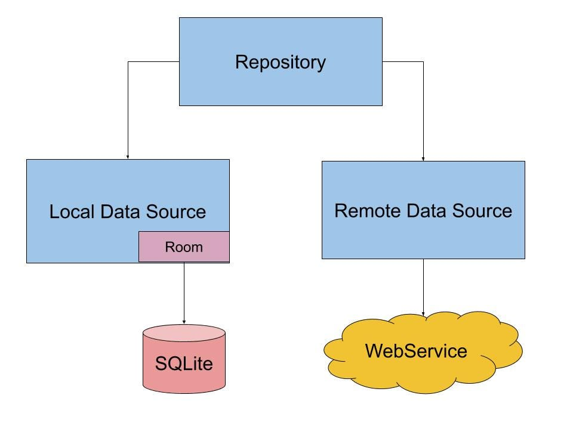

# Practica: Servicio con almacenamiento local y remoto en . NET

- [Practica: Servicio con almacenamiento local y remoto en . NET](#practica-servicio-con-almacenamiento-local-y-remoto-en--net)
  - [Objetivo](#objetivo)
  - [Descripción de la Práctica](#descripción-de-la-práctica)
    - [Pasos de implementación:](#pasos-de-implementación)
    - [Requisitos funcionales:](#requisitos-funcionales)
  - [Consideraciones de Diseño](#consideraciones-de-diseño)
  - [Requisitos Técnicos](#requisitos-técnicos)
    - [Arquitectura y código:](#arquitectura-y-código)
    - [Testing:](#testing)
    - [Documentación y control de versiones:](#documentación-y-control-de-versiones)
    - [Tecnologías recomendadas:](#tecnologías-recomendadas)
    - [Estructura de proyecto recomendada:](#estructura-de-proyecto-recomendada)

---

## Objetivo

El objetivo de esta práctica es desarrollar un servicio en **ASP.NET Core** que permita almacenar y gestionar datos tanto en un almacenamiento local (base de datos embebida o SQL Server local) como en un almacenamiento remoto (API REST). El servicio debe ser capaz de realizar operaciones CRUD (Crear, Leer, Actualizar, Eliminar) y manejar la comunicación con ambos tipos de almacenamiento de manera eficiente, segura y **asíncrona**.

---

## Descripción de la Práctica

Vamos a usar una API ficticia para simular el almacenamiento remoto.  Puedes utilizar la API de **JSONPlaceholder** (https://jsonplaceholder.typicode. com) o **DummyJson** (https://dummyjson.com/) que proporciona endpoints para realizar operaciones CRUD sobre recursos como usuarios, posts, comentarios, etc. 

**Recomendación:** Comienza probando la API de JSONPlaceholder, ya que es gratuita y no requiere autenticación. Deberás leer su documentación (https://github.com/typicode/json-server) para entender cómo hacer consultas.  Una vez la domines, podrás usar cualquier otra API REST que te guste.

Vamos a trabajar con el recurso **"users"** de JSONPlaceholder, que tiene la siguiente estructura: 

```json
{
  "id": 1,
  "name": "Leanne Graham",
  "username": "Bret",
  "email": "Sincere@april.biz",
  "address": {
    "street": "Kulas Light",
    "suite": "Apt. 556",
    "city": "Gwenborough",
    "zipcode": "92998-3874",
    "geo": {
      "lat":  "-37.3159",
      "lng": "81.1496"
    }
  },
  "phone": "1-770-736-8031 x56442",
  "website": "hildegard.org",
  "company": {
    "name": "Romaguera-Crona",
    "catchPhrase": "Multi-layered client-server neural-net",
    "bs": "harness real-time e-markets"
  }
}
```

**Nuestro objetivo** es crear un servicio cacheado de **tres niveles**: caché en memoria, base de datos local y API REST, y que pueda exportar los datos a un fichero JSON.

**Importante:** No necesitamos todos los campos que existen a nivel remoto.  En nuestra base de datos local y en nuestro servicio **solo vamos a manejar los siguientes campos**: 

- **id**: Identificador único del usuario. Se generará automáticamente a nivel remoto.
- **name**: Nombre completo del usuario. 
- **username**: Nombre de usuario.
- **email**:  Dirección de correo electrónico del usuario.

---

### Pasos de implementación:

1. **Modelo de dominio:** El primer paso es tener la clase de modelo `User` que represente los datos que vamos a manejar en nuestro servicio con los campos mencionados arriba.

2. **Entidad de base de datos:** A nivel de entidades de la base de datos (Entity Framework Core), tendremos `UserEntity` con los campos `Id`, `Name`, `Username`, `Email`, además de `CreatedAt` y `UpdatedAt` para llevar el control de las fechas de creación y actualización.

3. **Exportación a JSON:** Para exportar los datos a un fichero JSON, usaremos los datos de la entidad directamente (o del modelo de dominio).

4. **DTO para la API REST:** Para mapear los datos procedentes de la API REST, debes crear DTOs (Data Transfer Objects). Puedes usar herramientas online como: 
   - https://json2csharp.com
   - https://app.quicktype.io
   - O extensiones de Visual Studio/VS Code como "Paste JSON as Classes"

5. **Operaciones del servicio:** El servicio debe ser capaz de realizar las siguientes operaciones:
   - Obtener todos los usuarios. 
   - Obtener un usuario por su ID.
   - Crear un nuevo usuario.
   - Actualizar un usuario existente. 
   - Eliminar un usuario.
   - Exportar los usuarios a un fichero JSON. 

---

### Requisitos funcionales:

- ✅ El servicio debe trabajar con una **caché en memoria** (`IMemoryCache` o `MemoryCache`) para mejorar el rendimiento de las operaciones de lectura.
- ✅ El servicio debe permitir **exportar los datos** a un fichero JSON en el sistema de archivos local. 
- ✅ El servicio debe interactuar con una **base de datos local** usando Entity Framework Core (puede ser SQL Server LocalDB, SQLite, PostgreSQL local, etc.).
- ✅ El servicio debe interactuar con la **API REST remota** usando `HttpClient` (preferiblemente con `IHttpClientFactory`) o **Refit**.
- ✅ El servicio debe manejar **errores y excepciones** de manera adecuada usando **Result<T>** (Railway Oriented Programming con CSharpFunctionalExtensions es recomendado).
- ✅ El servicio debe permitir la **configuración externa** de: 
  - URL de la API REST
  - Configuración de caché (tamaño, tiempo de expiración)
  - Credenciales si fueran necesarias
  - Tasa de refresco de consultas a la API REST
  
  Esto se debe hacer a través de `appsettings.json` y el sistema de configuración de ASP.NET Core. 

- ✅ Debe haber un **sistema de notificaciones** (usando `IObservable<T>` de System.Reactive o eventos de C#) que avise del refresco de la base de datos, así como de las operaciones de creación, actualización y eliminación de usuarios. 

- ✅ Debe haber un **sistema de logging** (usando `ILogger<T>` de Microsoft. Extensions.Logging) que registre las operaciones realizadas y los errores ocurridos.  Los logs deben almacenarse de forma que solo se conserven los últimos 7 días (puedes usar Serilog con rolling files).

---



---

## Consideraciones de Diseño

**Comportamiento del sistema:**

- ✅ **Al arrancar el programa**, se borra la base de datos local y se carga con el contenido de la API REST. 

- ✅ **Cada 30 segundos**, automáticamente y en segundo plano (usando `IHostedService` o `BackgroundService`), se sincroniza la base de datos local con la API REST. Es decir:
  - Se borra todo el contenido de la caché.
  - Se borra todo el contenido de la base de datos local.
  - Se vuelve a cargar desde la API REST. 

- ✅ **Al obtener todos los usuarios (`GET /api/users`)**:
  - Se devuelven los datos desde la base de datos local (ya cargada al iniciar).
  - Si no hay datos en la base de datos, se obtienen desde la API REST, se almacenan en la base de datos y se devuelven.

- ✅ **Al obtener un usuario por su ID (`GET /api/users/{id}`)**:
  - Se busca primero en la **caché**.
  - Si no está en la caché, se busca en la **base de datos local** y se añade a la caché.
  - Si no está en la base de datos, se obtiene desde la **API REST**, se almacena en la base de datos, se añade a la caché y se devuelve.
  - Si no existe en ningún lugar, se devuelve un error `404 Not Found`.

- ✅ **Al crear un nuevo usuario (`POST /api/users`)**:
  - Se envía a la API REST.
  - Se obtiene el ID generado por la API remota.
  - Se almacena en la base de datos local. 
  - Se añade a la caché.
  - Se devuelve el usuario creado con código `201 Created`.

- ✅ **Al actualizar un usuario existente (`PUT /api/users/{id}`)**:
  - Se envía a la API REST. 
  - Si se actualiza correctamente, se actualiza en la base de datos local y en la caché.
  - Se devuelve el usuario actualizado con código `200 OK`.
  - Si no existe, se devuelve un error `404 Not Found`.

- ✅ **Al eliminar un usuario (`DELETE /api/users/{id}`)**:
  - Se elimina de la API REST.
  - Si se elimina correctamente, se elimina de la base de datos local y de la caché.
  - Se devuelve código `204 No Content`.
  - Si no existe, se devuelve un error `404 Not Found`.

- ✅ **Al exportar los usuarios a un fichero JSON (`GET /api/users/export` o endpoint similar)**:
  - Se obtienen todos los usuarios siguiendo la lógica de "obtener todos los usuarios".
  - Se serializan a JSON usando `System.Text.Json`.
  - Se escriben en un fichero JSON en el sistema de archivos local (por ejemplo, en la carpeta `wwwroot/exports` o una carpeta configurada).
  - Se devuelve la ruta del fichero generado o el propio fichero como descarga.

---

## Requisitos Técnicos

### Arquitectura y código:

- ✅ Debe ser lo más **asíncrono** posible (todos los métodos deben ser `async` y devolver `Task<T>`).
- ✅ Se recomienda usar **programación reactiva** con `IObservable<T>` (System.Reactive) para las notificaciones, aunque también se pueden usar eventos de C#.
- ✅ Debes crear el **modelo de dominio** necesario (`User`).
- ✅ Debes crear todos los **DTOs**:
  - Request DTOs (para recibir datos del cliente).
  - Response DTOs (para enviar datos al cliente).
  - DTOs para mapear la respuesta de la API REST remota.
- ✅ Debes crear las **entidades** de Entity Framework Core (`UserEntity`).
- ✅ Debes implementar los **mapeos** entre DTOs, entidades y modelo de dominio (puedes usar AutoMapper o mapeo manual).
- ✅ Debes definir claramente los **errores de dominio** (excepciones personalizadas o usando `Result<T, Error>`) y cómo los manejas.
- ✅ Debes usar **Railway Oriented Programming** con `CSharpFunctionalExtensions` para el manejo de errores de forma funcional (recomendado pero no obligatorio si prefieres excepciones bien manejadas).

### Testing:

- ✅ Debes **testear el servicio** con: 
  - **Pruebas unitarias** (usando NUnit, xUnit o MSTest).
  - **Pruebas de integración** (opcional pero recomendado, usando `WebApplicationFactory`).
  
- ✅ Debes **testear el repositorio remoto** (cliente HTTP):
  - **Pruebas unitarias** con Moq para simular `HttpClient`.
  - **Pruebas de integración** (opcional, con `HttpClient` real contra JSONPlaceholder).

- ✅ Debes **testear el repositorio local** (Entity Framework Core):
  - **Pruebas de integración** con una base de datos en memoria (`UseInMemoryDatabase`) o con **Testcontainers** (opcional pero recomendado).

### Documentación y control de versiones:

- ✅ Debes **documentar el código** con comentarios XML y README.md explicando:
  - La arquitectura del proyecto.
  - Cómo ejecutar la aplicación.
  - Cómo ejecutar los tests.
  - Configuración necesaria (`appsettings.json`).

- ✅ Debes usar un **sistema de control de versiones** (Git) y alojar el proyecto en un repositorio remoto (GitHub, GitLab, Azure DevOps, etc.).

- ✅ Se valorará el uso de **Docker** para contenerizar la aplicación (Dockerfile y docker-compose.yml).

- ✅ Se valorará la implementación de un **pipeline de CI/CD** (GitHub Actions, Azure Pipelines, GitLab CI) para ejecutar tests automáticamente.

---

### Tecnologías recomendadas:

- **Framework:** ASP.NET Core 8.0
- **ORM:** Entity Framework Core
- **Base de datos:** SQL Server LocalDB, SQLite, PostgreSQL (con Docker)
- **Cliente HTTP:** `IHttpClientFactory` + `HttpClient` o **Refit**
- **Caché:** `IMemoryCache`
- **Logging:** `ILogger<T>` + Serilog
- **Serialización JSON:** `System.Text.Json`
- **Manejo de errores:** `CSharpFunctionalExtensions` (Result<T>)
- **Programación reactiva:** `System.Reactive` (Rx. NET)
- **Testing:** NUnit o xUnit + Moq + FluentAssertions
- **Documentación API:** Swagger (Swashbuckle)

---

### Estructura de proyecto recomendada:

```
MiAplicacion/
├── src/
│   ├── MiAplicacion. Api/              # Proyecto ASP.NET Core Web API
│   ├── MiAplicacion.Domain/           # Modelos de dominio
│   ├── MiAplicacion. Application/      # Servicios, DTOs, interfaces
│   ├── MiAplicacion.Infrastructure/   # Repositorios, DbContext, cliente HTTP
│   └── MiAplicacion. Shared/           # Utilidades, extensiones, constantes
├── tests/
│   ├── MiAplicacion.UnitTests/
│   └── MiAplicacion.IntegrationTests/
├── README.md
├── . gitignore
└── MiAplicacion.sln
```

---

